# DataCorp Analytics: entorno DataOps

Parte práctica del taller asíncrono.

- **Curso:** Enfoque DataOps
- **Profesora:** Maia José Torres Nieves
- **Estudiante:** Gabriel Alejandro Rodríguez Pulido
- **Universidad:** Escuela Colombiana de Ingeniería Julio Garavito

## Contexto del caso

DataCorp Analytics ofrece servicios de análisis predictivo para el sector retail. Su equipo de ciencia de datos trabaja directamente sobre la base de datos de producción, lo que ha causado corrupción de datos, caídas del servicio y pérdida de confianza de los clientes. En este repositorio se diseña, de forma simulada, un entorno DataOps con entornos aislados, gestión de datos maestros y estrategias de control y replicabilidad (control de versiones, IaC y CD).

## Estrategia de ramas

El repositorio aplica la misma lógica de entornos que se propone para la empresa:

| Rama | Equivale a | Regla |
|---|---|---|
| `main` | Producción | Solo recibe cambios desde `develop` por pull request |
| `develop` | QA / staging | Integra las ramas de cada actividad por pull request |
| `feature/actividad-N-...` | Desarrollo | Una rama por actividad |

## Contenido

| Actividad | Tema | Documento | Estado |
|---|---|---|---|
| 1 | Diseño de entornos aislados | [docs/01-entornos-aislados.md](docs/01-entornos-aislados.md) | Completada |
| 2 | Implementación de MDM | [docs/02-mdm.md](docs/02-mdm.md) | Completada |
| 3 | Control de versiones para todo | [docs/03-control-versiones.md](docs/03-control-versiones.md) | Completada |
| 4 | Infraestructura como Código | [docs/04-iac.md](docs/04-iac.md) | Completada |
| 5 | Continuous Delivery para DataOps | [docs/05-continuous-delivery.md](docs/05-continuous-delivery.md) | Completada |
| 6 | Integración final | [docs/06-integracion-final.md](docs/06-integracion-final.md) | Pendiente |

Las capturas de pantalla de cada actividad están en la carpeta [evidencias](evidencias/).   

## Configuración inicial del repositorio

Repositorio creado con las ramas `main` y `develop`:

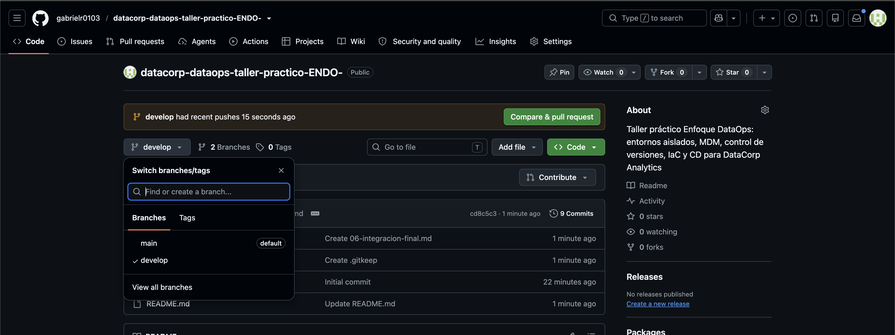

README inicial publicado en `develop`:

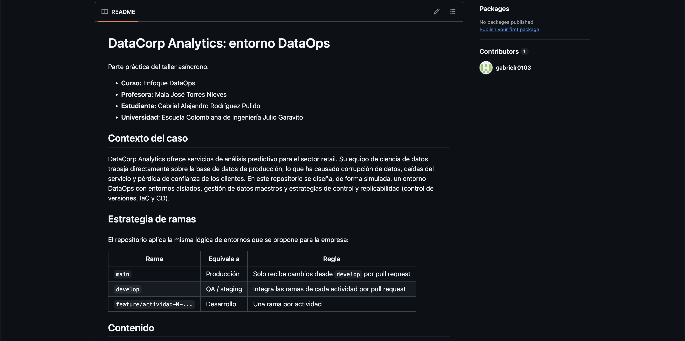

## Actividad 1: Diseño de entornos aislados

Desarrollo completo en [docs/01-entornos-aislados.md](docs/01-entornos-aislados.md).

- 1.1: definición de DEV, QA/Staging y PROD para DataCorp (propósito, acceso, datos, infraestructura y control de código), con la justificación de cada decisión.
- 1.2: diagrama del recorrido de un cambio en el modelo de predicción de ventas, desde el push en una rama feature hasta la disponibilidad en vivo.
- 1.3: protocolo de actuación cuando el modelo falla en QA, con las herramientas y validaciones que impiden que llegue a producción.

### Evidencias

Documento de la actividad en GitHub, con la tabla de entornos y el diagrama de flujo:

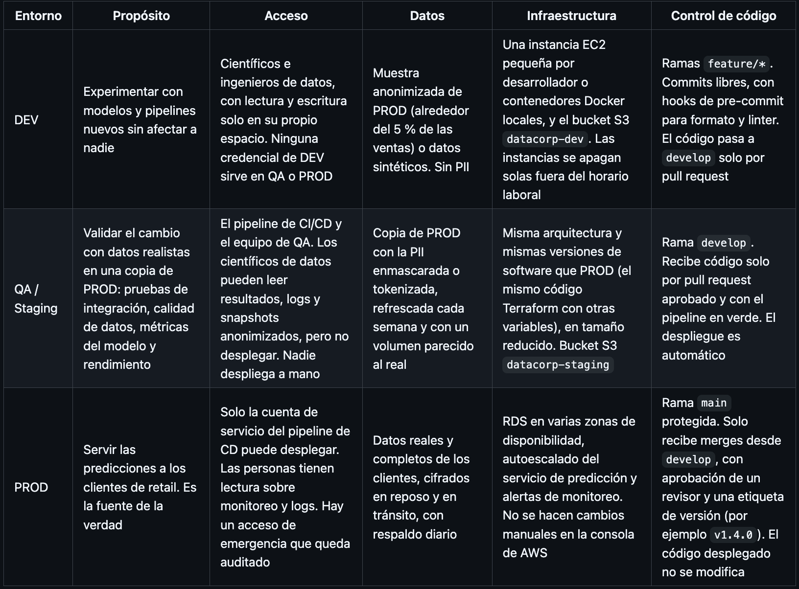

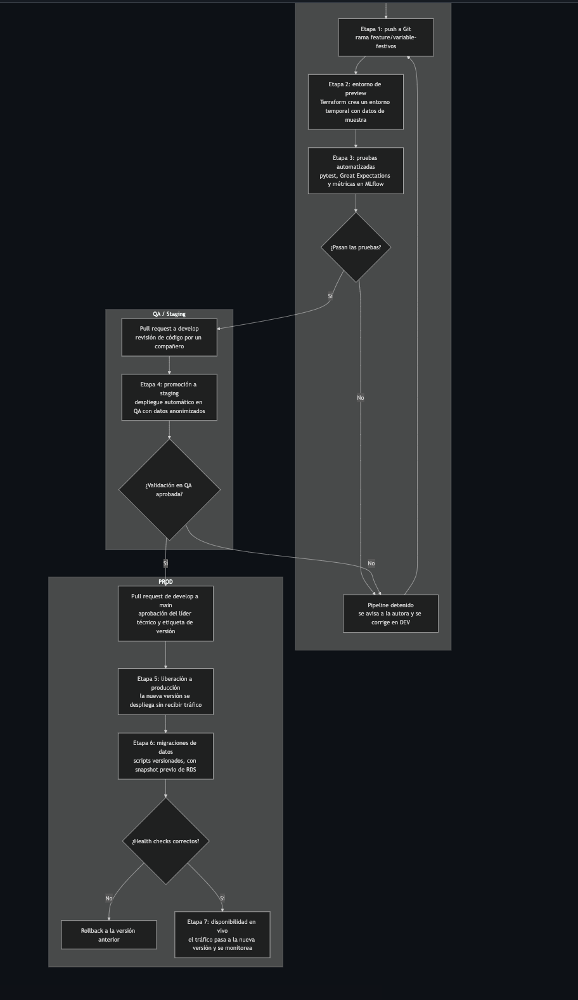

Pull request de la actividad hacia `develop`:

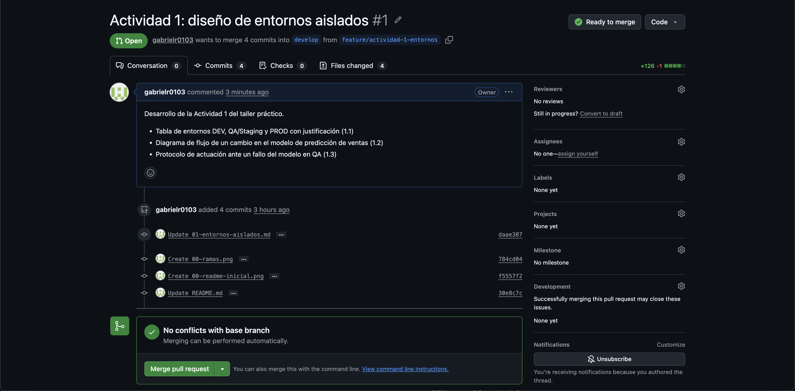

Pull request fusionado en `develop`:

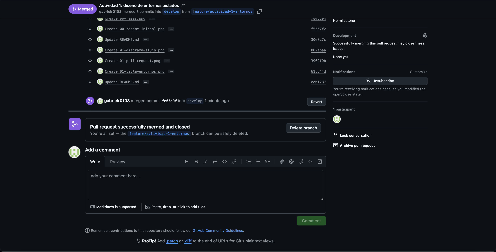

## Actividad 2: Implementación de MDM

Desarrollo completo en [docs/02-mdm.md](docs/02-mdm.md).

- 2.1: seis entidades maestras para DataCorp (Cliente, Producto, Tienda, Proveedor, Cuenta y Calendario comercial) con sus atributos, fuentes, reglas de calidad y responsable.
- 2.2: diagrama del flujo de consolidación desde las fuentes hasta el registro maestro, y de la sincronización con los sistemas transaccionales y analíticos.
- 2.3: políticas de gobernanza del dato maestro Cliente: definición de cliente activo, limpieza y deduplicación, flujo de aprobación de cambios, y acceso y seguridad.
- 2.4: simulación de un conflicto entre dos definiciones de cliente activo, cómo lo resuelve MDM y su efecto en la replicabilidad de los modelos.

### Evidencias

Tabla de entidades maestras (2.1):

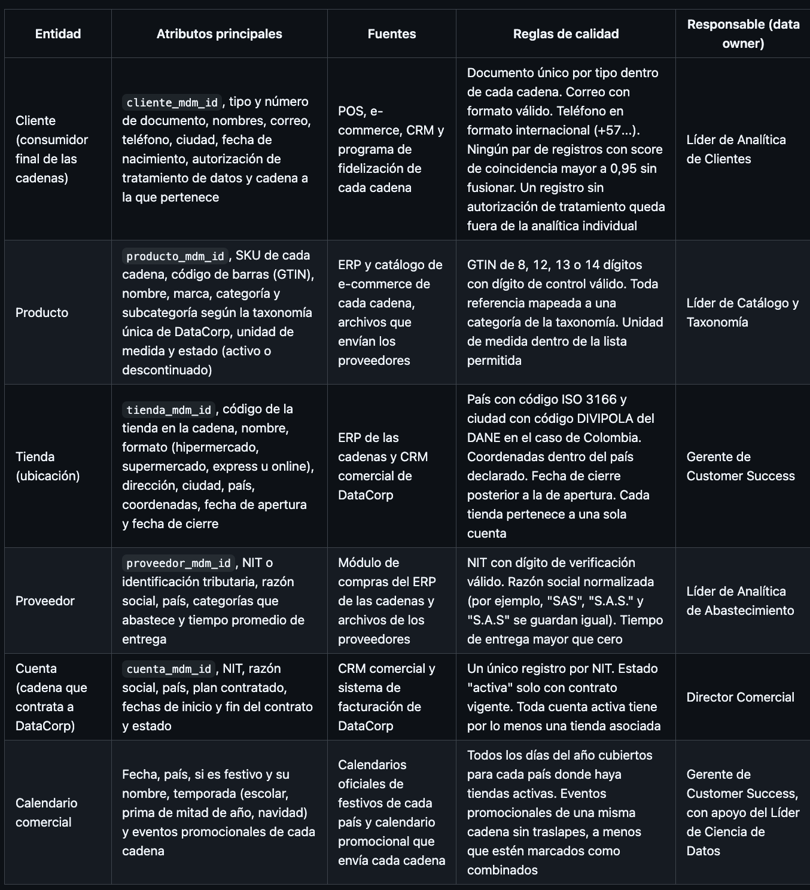

Diagrama de consolidación y sincronización (2.2):

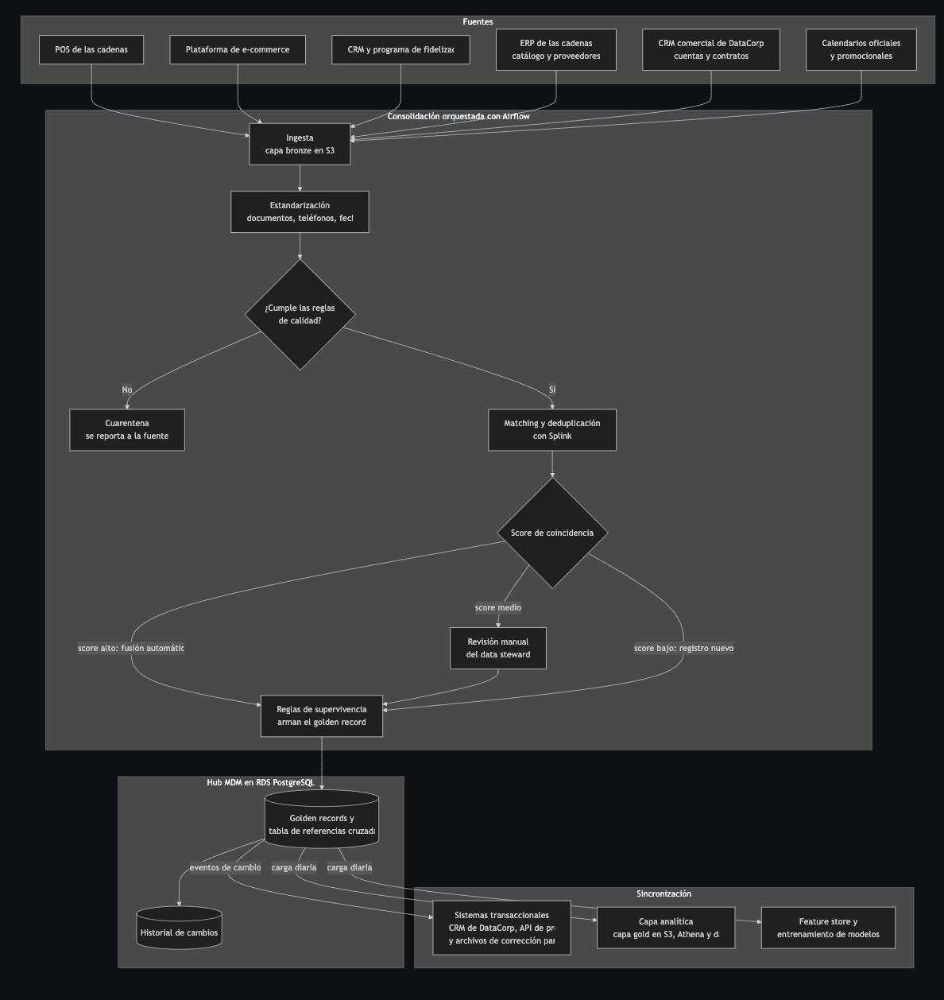

Definición versionada de cliente activo (2.3):

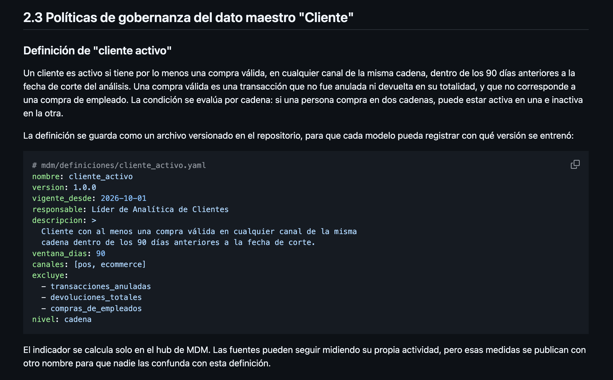

Conflicto entre definiciones de cliente activo (2.4):

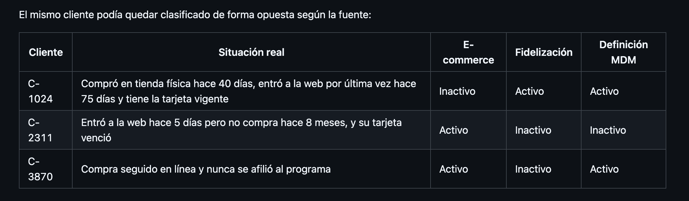

Pull request de la actividad hacia `develop`:

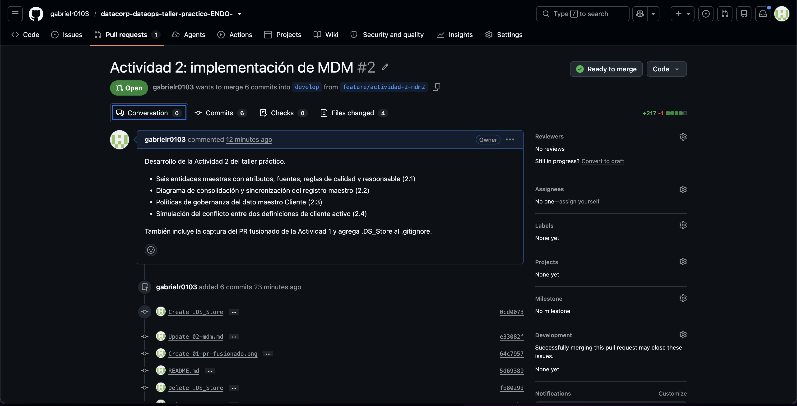

Pull request fusionado en `develop`:

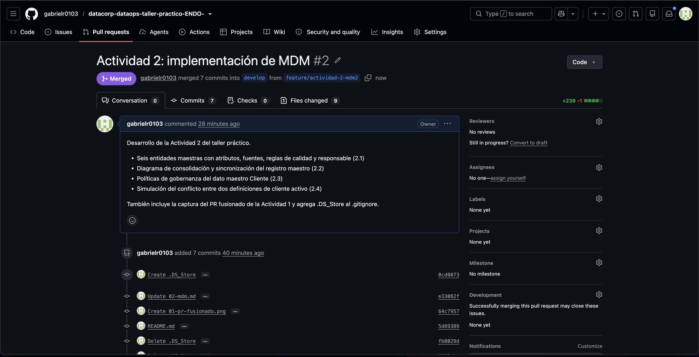

## Actividad 3: Control de versiones para todo

Desarrollo completo en [docs/03-control-versiones.md](docs/03-control-versiones.md). La explicación de qué se versiona y qué no (3.2) está en esta sección del README, como pide la actividad.

- 3.1: estructura del repositorio con código, notebook exportado, SQL, configuraciones, DAG de Airflow, Jenkinsfile, Terraform y documentación de procedencia de datos.
- 3.2: qué se versiona en Git, qué no y por qué, más el versionado de la procedencia de datos (abajo).
- 3.3: simulación de un commit y un pull request, con el flujo de revisión de código y su integración con QA.

### Qué se versiona en Git

| Artefacto | Ubicación | Por qué se versiona |
|---|---|---|
| Código Python y pruebas | `src/`, `tests/` | Es la lógica del modelo. Cada cambio queda con autor, fecha y motivo, y se puede revertir |
| Notebooks exportados | `notebooks/*.py` | En formato `.py` el diff muestra solo el código que cambió, sin las salidas |
| Consultas y migraciones SQL | `sql/` | La consulta decide qué datos entran al modelo y las migraciones cambian la base. Las dos tienen que poder revisarse y revertirse |
| Configuración por entorno | `config/` | Los umbrales y las conexiones cambian el comportamiento sin tocar el código, así que un cambio de umbral también pasa por revisión |
| Definiciones de MDM | `mdm/definiciones/` | Cada modelo registra la versión de la definición de cliente activo con la que se entrenó (Actividad 2.4) |
| Definiciones de pipeline | `pipelines/`, `dvc.yaml` | Sin el DAG y el Jenkinsfile de cada momento no se sabe cómo se produjo un modelo |
| Infraestructura | `infra/terraform/*.tf` | Con el código de Terraform los entornos se pueden recrear iguales (Actividad 4) |
| Punteros y procedencia de datos | `data/raw/*.dvc`, `data/procedencia/` | Son archivos pequeños que identifican la versión exacta de cada dataset |
| Dependencias | `requirements.txt` | Con las versiones fijas, DEV, QA, PROD y Jenkins instalan exactamente lo mismo |

### Qué no se versiona en Git

| Artefacto | Dónde queda | Por qué no va en Git |
|---|---|---|
| Datos crudos y procesados (`data/raw/*.csv`, `data/processed/`) | S3, gestionados con DVC | Pesan cientos de megas y Git guarda cada versión completa en el historial para siempre. Además pueden tener datos personales, que después no se pueden sacar del historial con facilidad |
| Modelos entrenados (`*.pkl`, `*.joblib`, `mlruns/`) | Registro de modelos de MLflow | Son binarios que se pueden reconstruir con el código, los datos y la configuración. MLflow guarda además sus métricas y etiquetas |
| Notebooks `.ipynb` | Se versiona la exportación `.py` | Sus salidas pueden incluir datos, y el JSON cambia en cada ejecución aunque el código sea el mismo |
| Estado de Terraform (`*.tfstate`) y carpeta `.terraform/` | Backend S3 cifrado, con bloqueo | El estado guarda identificadores y a veces contraseñas de los recursos. Si dos personas lo modifican desde copias locales, se corrompe |
| Credenciales (`.env`, `*.pem`, `config/*.local.yaml`) | AWS Secrets Manager | Un secreto que llega a Git queda en el historial aunque después se borre el archivo |
| Archivos generados (`__pycache__/`, `reportes/`) | Se regeneran en cada ejecución | No aportan información al historial. La excepción es `reportes/metricas.json`, que DVC usa para comparar métricas entre versiones |
| Archivos del sistema (`.DS_Store`) | En ningún lado | Los crea macOS y no tienen relación con el proyecto (ver Actividad 2) |

Todas estas exclusiones están escritas en el [.gitignore](.gitignore).

### Versionado de la procedencia de datos

Los datos no están en Git, pero su versión sí. Cuando un archivo se agrega con `dvc add`, DVC lo sube al remoto de S3 y deja en Git un puntero `.dvc` con el md5 de su contenido. Si el archivo cambia, aunque sea en una fila, cambia el md5, y ese cambio aparece en el historial de Git como cualquier otro.

Al lado de cada puntero hay un archivo en `data/procedencia/` que explica de dónde salieron los datos: sistema y tablas de origen, consulta SQL, script y commit que los extrajeron, parámetros de la extracción (incluida la versión de la definición de cliente activo), número de filas, si contienen PII y quién responde por ellos. El campo `version_dvc` tiene que coincidir con el md5 del puntero, y la plantilla de pull request pide actualizar este archivo cada vez que cambian los datos.

Cada entrenamiento registra en MLflow el commit del código, el md5 de los datos y la versión de la definición de cliente activo (ver `src/modelos/entrenar.py`). Con esos tres valores se puede reconstruir cualquier modelo:

```bash
git checkout <commit-registrado-en-mlflow>
dvc pull     # trae de S3 la versión de los datos que corresponde a ese commit
dvc repro    # vuelve a ejecutar las etapas validar, features y entrenar
```

Los md5, el commit y el número de filas que aparecen en `data/procedencia/` y en los punteros `.dvc` son ilustrativos, porque los datos del caso son simulados.

### Evidencias

Estructura creada con el script de la actividad:

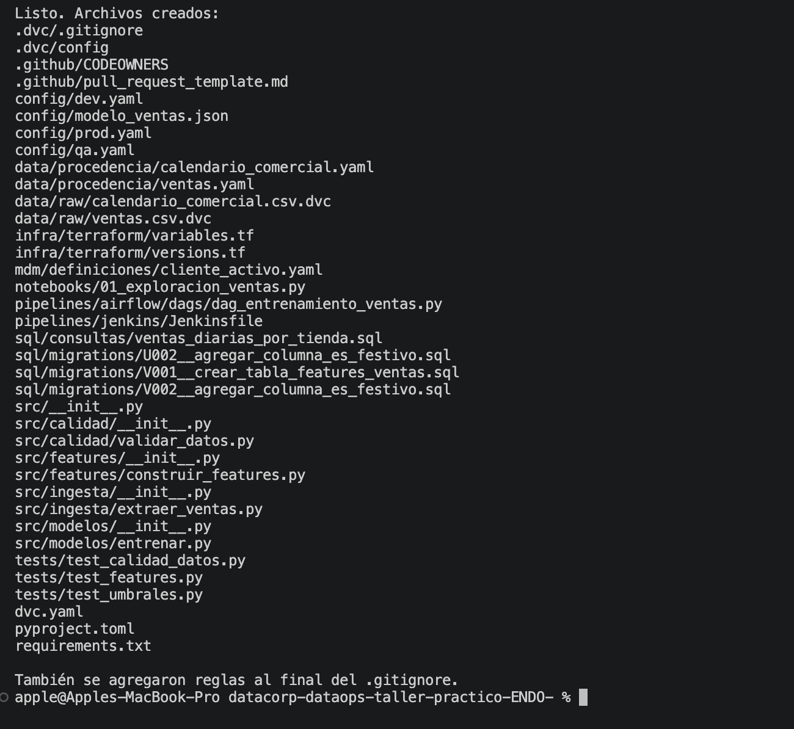


Pruebas y linter ejecutados en local antes de abrir el pull request:

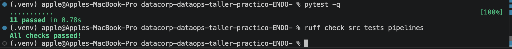

Pull request de la actividad hacia `develop`, con la plantilla de revisión diligenciada:

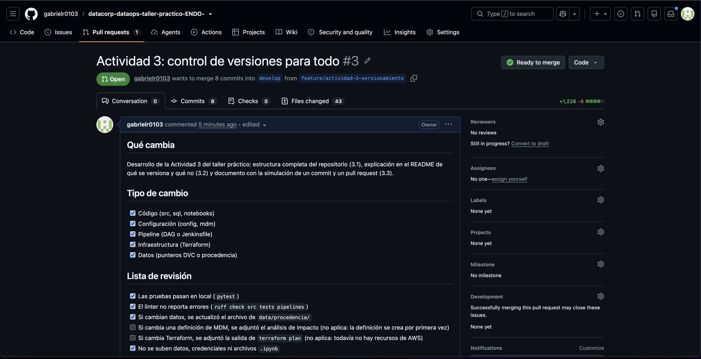

Commits separados por tipo de artefacto (Conventional Commits):

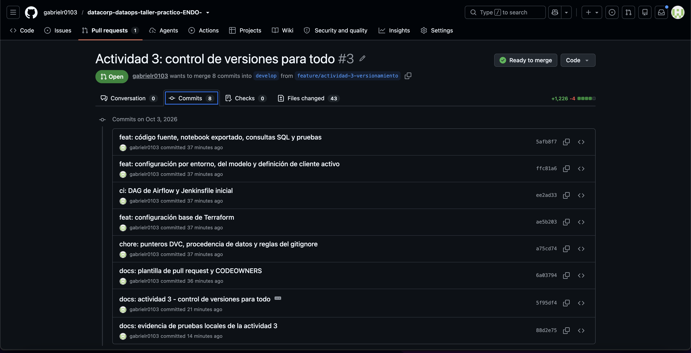

Estructura del repositorio en GitHub:

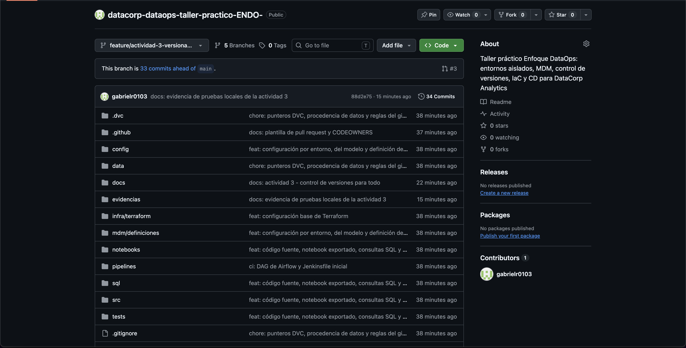

Diagrama del flujo de revisión e integración con QA (3.3):


Regla de protección activa sobre `main` y `develop`:

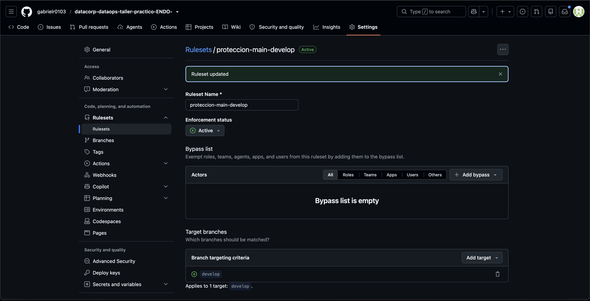

Pull request fusionado en `develop`:

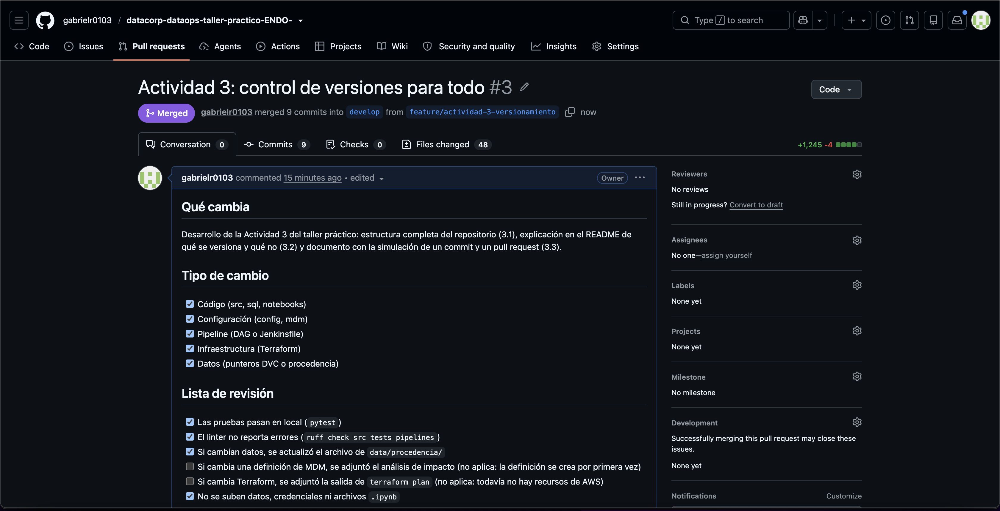

## Actividad 4: Infraestructura como Código (IaC)

Desarrollo completo en [docs/04-iac.md](docs/04-iac.md). El código de Terraform está en [infra/terraform](infra/terraform).

- 4.1: archivos de Terraform con el bucket S3 de staging, las estaciones EC2 de DEV, la base RDS de PROD y el rol IAM con permisos restringidos. El mismo código crea los tres entornos, y lo que cambia entre ellos está en `envs/*.tfvars`.
- 4.2: cómo ese código permite replicar entornos idénticos y qué comandos se usan para aplicar los cambios.
- 4.3: flujo de trabajo de IaC desde la edición del código hasta el despliegue, con diagrama.

### Evidencias

Formato y sintaxis del código validados en local con Terraform 1.12.2:

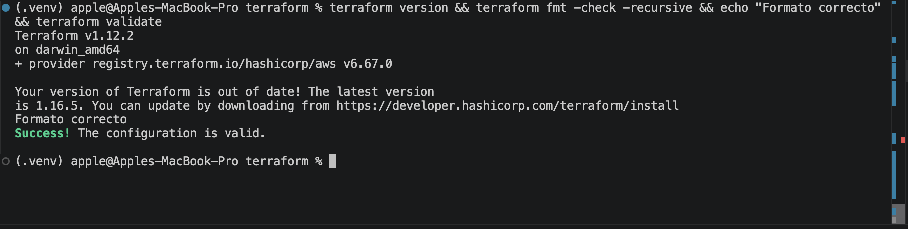

Pull request de la actividad hacia `develop`, con la plantilla de revisión diligenciada:

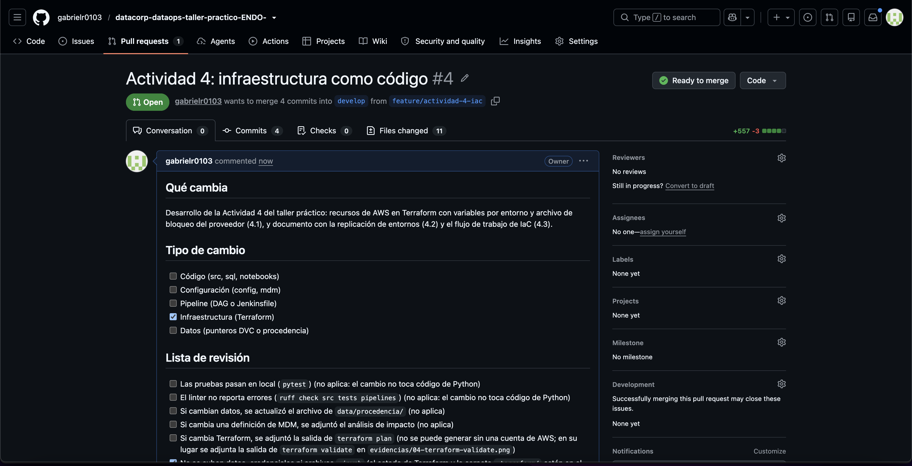

Commits de la actividad:

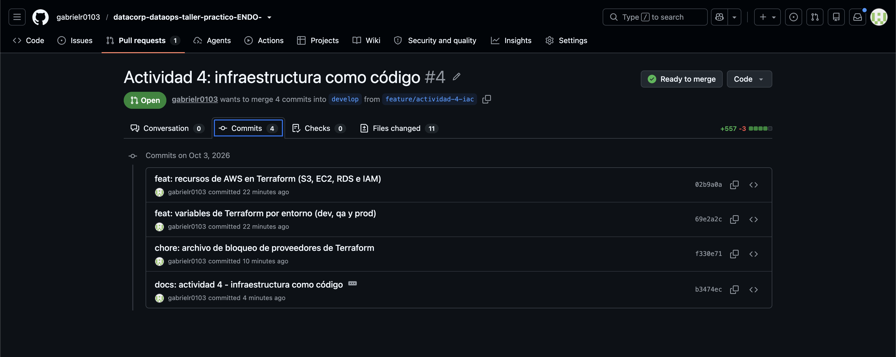

Archivos de Terraform en el repositorio:

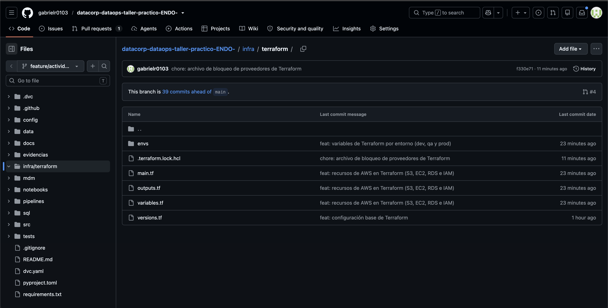

Diagrama del flujo de trabajo de IaC (4.3):

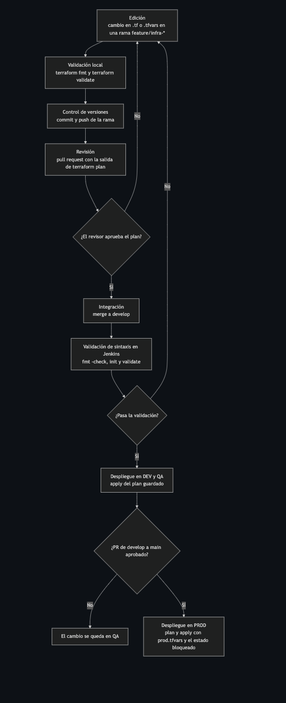

Pull request fusionado en `develop`:

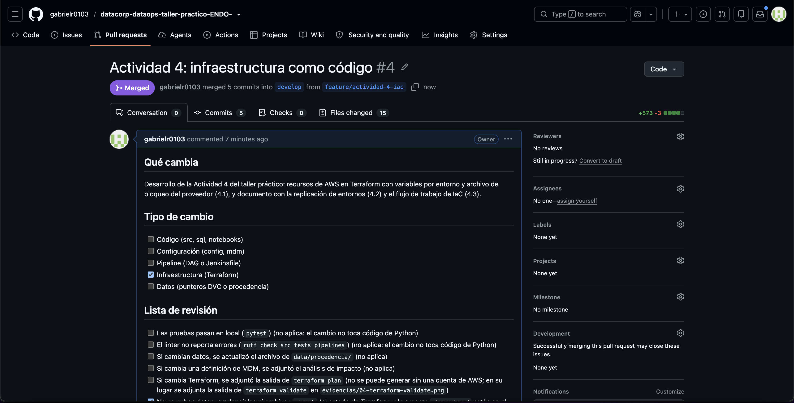

## Actividad 5: Continuous Delivery para DataOps

Desarrollo completo en [docs/05-continuous-delivery.md](docs/05-continuous-delivery.md). El pipeline está en [pipelines/jenkins/Jenkinsfile](pipelines/jenkins/Jenkinsfile).

- 5.1: pipeline de CD del modelo de predicción de ventas con sus seis etapas, y qué corre en cada rama.
- 5.2: herramientas, criterios de éxito y acciones en caso de fallo de cada etapa.
- 5.3: simulación real de un fallo en el Test de Datos (15 % de nulos en `clientes_activos`) y protocolo de actuación.
- 5.4: diagrama del pipeline completo con control de versiones, IaC y CD.

### Evidencias

Simulación del pipeline con datos válidos: pasa todas las etapas.

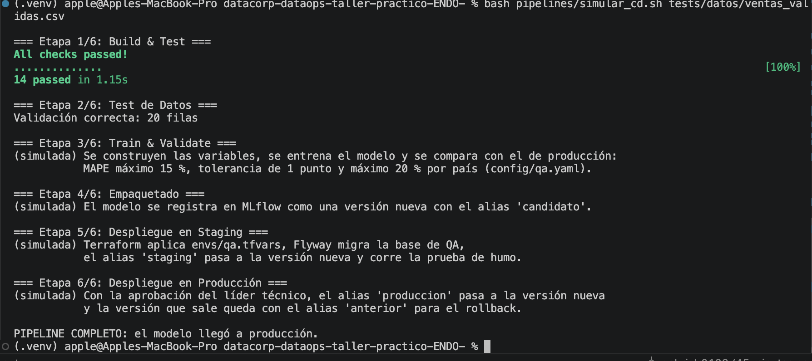

Simulación con 15 % de nulos: el pipeline se detiene en el Test de Datos y termina con código de salida 1.

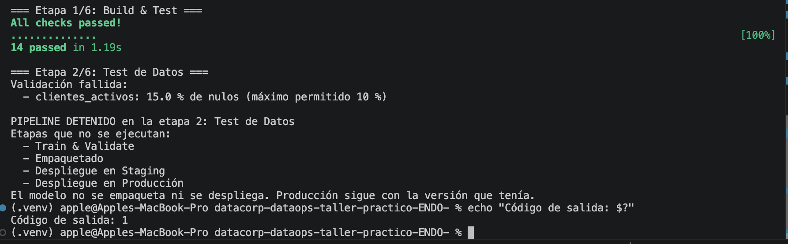

Pull request de la actividad hacia `develop`, con la plantilla de revisión diligenciada:

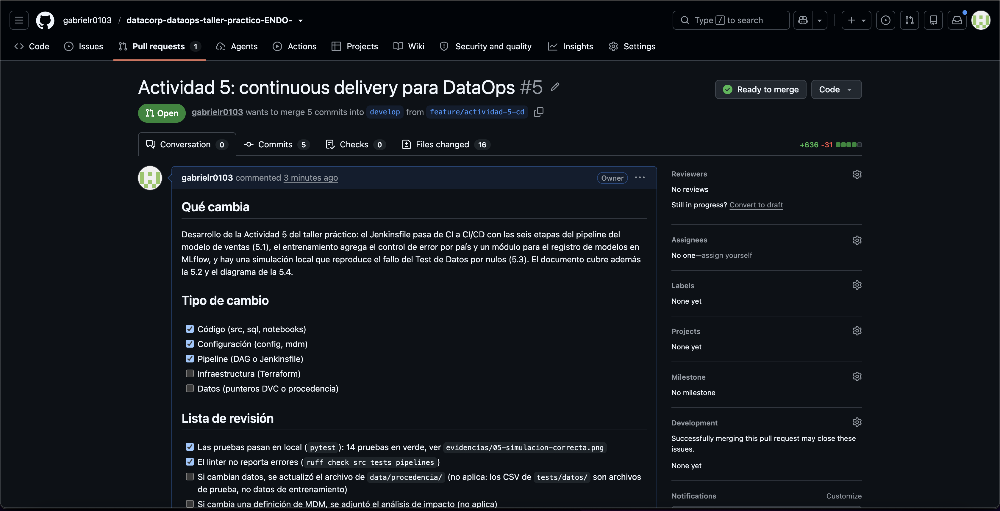

Commits de la actividad:

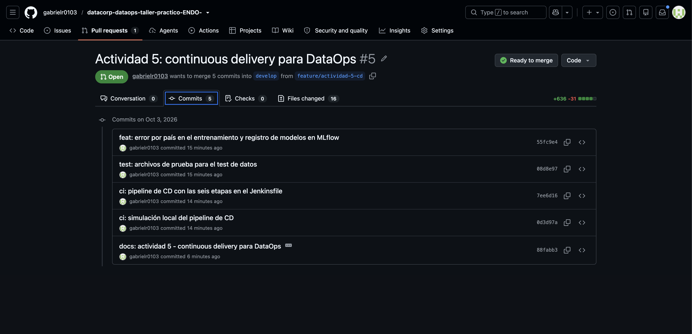

Inicio del Jenkinsfile con las reglas por rama y la etapa Build & Test:

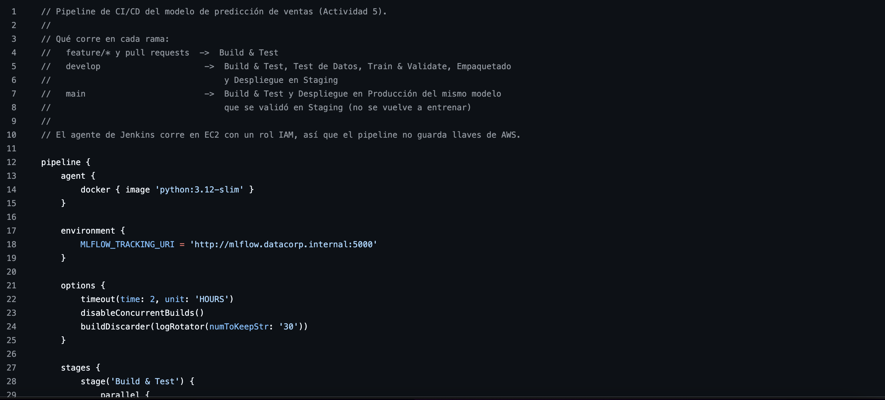

Diagrama del pipeline completo con los tres pilares (5.4):

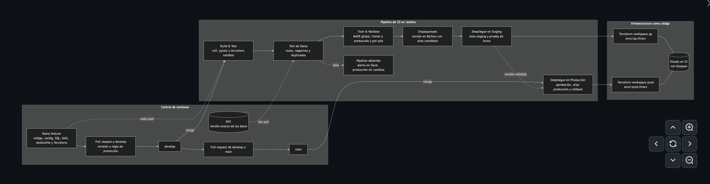