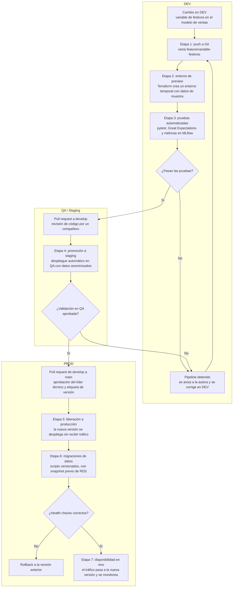

# Actividad 1: Diseño de entornos aislados

Hoy los científicos de datos de DataCorp entrenan y prueban sus modelos directamente contra la base de datos de producción. De ahí vienen los incidentes que reporta la dirección. Ha habido datos corruptos por escrituras de prueba y caídas del servicio cuando una consulta pesada o un modelo nuevo saturó la base, y por eso varios clientes ya no confían en las predicciones. La propuesta separa el trabajo en tres entornos (DEV, QA y PROD), cada uno con sus propias reglas sobre quién entra y con qué datos se trabaja, de forma que ningún cambio llegue a producción sin pasar antes por los otros dos.

La infraestructura propuesta está en AWS y se define con Terraform (Actividad 4). El pipeline de CI/CD corre en Jenkins y el entrenamiento de modelos se orquesta con Airflow (Actividades 3 y 5).

## 1.1 Estructura de los entornos

| Entorno | Propósito | Acceso | Datos | Infraestructura | Control de código |
|---|---|---|---|---|---|
| DEV | Experimentar con modelos y pipelines nuevos sin afectar a nadie | Científicos e ingenieros de datos, con lectura y escritura solo en su propio espacio. Ninguna credencial de DEV sirve en QA o PROD | Muestra anonimizada de PROD (alrededor del 5 % de las ventas) o datos sintéticos. Sin PII | Una instancia EC2 pequeña por desarrollador o contenedores Docker locales, y el bucket S3 `datacorp-dev`. Las instancias se apagan solas fuera del horario laboral | Ramas `feature/*`. Commits libres, con hooks de pre-commit para formato y linter. El código pasa a `develop` solo por pull request |
| QA / Staging | Validar el cambio con datos realistas en una copia de PROD: pruebas de integración, calidad de datos, métricas del modelo y rendimiento | El pipeline de CI/CD y el equipo de QA. Los científicos de datos pueden leer resultados, logs y snapshots anonimizados, pero no desplegar. Nadie despliega a mano | Copia de PROD con la PII enmascarada o tokenizada, refrescada cada semana y con un volumen parecido al real | Misma arquitectura y mismas versiones de software que PROD (el mismo código Terraform con otras variables), en tamaño reducido. Bucket S3 `datacorp-staging` | Rama `develop`. Recibe código solo por pull request aprobado y con el pipeline en verde. El despliegue es automático |
| PROD | Servir las predicciones a los clientes de retail. Es la fuente de la verdad | Solo la cuenta de servicio del pipeline de CD puede desplegar. Las personas tienen lectura sobre monitoreo y logs. Hay un acceso de emergencia que queda auditado | Datos reales y completos de los clientes, cifrados en reposo y en tránsito, con respaldo diario | RDS en varias zonas de disponibilidad, autoescalado del servicio de predicción y alertas de monitoreo. No se hacen cambios manuales en la consola de AWS | Rama `main` protegida. Solo recibe merges desde `develop`, con aprobación de un revisor y una etiqueta de versión (por ejemplo `v1.4.0`). El código desplegado no se modifica |

### Justificación de las decisiones

DEV trabaja con datos reducidos y sin PII porque es el entorno donde se esperan errores. Si un notebook borra una tabla o un script escribe datos inválidos, el daño se queda en una muestra que se regenera en minutos. Quitarle a DEV cualquier acceso a PROD ataca la causa del incidente de corrupción de datos, que hoy ocurre porque el mismo usuario que experimenta tiene permisos de escritura sobre la base real. El apagado automático de las instancias es una decisión de costos: un entorno de experimentación no necesita estar encendido de noche.

QA tiene la misma arquitectura que PROD porque su trabajo es anticipar cómo se va a comportar el cambio en producción. Si QA corre con otra versión de PostgreSQL o con un volumen de datos mucho menor, una prueba en verde dice poco. Los datos van anonimizados aunque QA sea una réplica. Para validar un modelo de ventas nadie necesita ver nombres, documentos o correos de los clientes, y cada copia sin proteger de esa información es un riesgo legal (en Colombia aplica la Ley 1581 de 2012 de protección de datos personales). Si una de esas copias se filtra, el problema de confianza con los clientes de DataCorp empeora.

PROD es el único entorno donde ninguna persona tiene permisos de escritura. Las caídas del servicio que ha sufrido DataCorp vienen de cambios aplicados sin pruebas previas, así que la regla es que todo lo que llega a PROD lo despliega el pipeline a partir de una versión etiquetada en `main`. Si una versión falla, se regresa a la etiqueta anterior en vez de parchear en caliente. Con eso queda un historial de qué versión del modelo estaba en servicio en cada momento, que es lo que hace falta para responderle a un cliente cuando pregunta de dónde salió una predicción.

## 1.2 Flujo de un cambio en un modelo predictivo

Como ejemplo, una científica de datos quiere agregar al modelo de predicción de ventas una variable que indique si el día es festivo. El diagrama muestra el recorrido de ese cambio por los tres entornos.

Explicación de cada etapa:

1. Push a Git (rama feature). La científica trabaja en la rama `feature/variable-festivos`, creada desde `develop`. Cada push dispara el pipeline en Jenkins. Nada de lo que pase en esta rama toca QA ni PROD.
2. Creación del entorno de preview. Jenkins ejecuta Terraform sobre un workspace temporal y levanta una copia pequeña del entorno con datos de muestra. Así el cambio se ve funcionando de punta a punta antes de pedir revisión. El entorno se destruye cuando la rama se fusiona o se cierra, para no dejar recursos cobrando.
3. Pruebas automatizadas. Corren las pruebas unitarias del código de variables con pytest y las validaciones de calidad de los datos de entrada con Great Expectations. Después se hace un entrenamiento corto y sus métricas quedan registradas en MLflow. Si algo falla, el pipeline se detiene y la autora corrige en DEV.
4. Promoción a staging. Con las pruebas en verde se abre el pull request hacia `develop`. Otro miembro del equipo revisa el código y, al aprobarse el merge, el pipeline despliega en QA de forma automática. En QA se aplican las migraciones de datos sobre la copia anonimizada, el modelo se entrena con esos datos y se compara con el modelo que está en producción. También se mide la latencia del servicio de predicción.
5. Liberación a producción. Si QA aprueba, se abre el pull request de `develop` a `main`. El líder técnico lo aprueba, se crea la etiqueta de versión y el pipeline despliega la nueva versión en PROD al lado de la actual, todavía sin tráfico (despliegue blue-green).
6. Migraciones de datos. Si el cambio necesita una columna nueva o recalcular una tabla de variables, los scripts de migración versionados en `sql/migrations/` se ejecutan en este punto, después de tomar un snapshot de RDS. Son los mismos scripts que ya corrieron en QA.
7. Disponibilidad en vivo. Cuando los health checks pasan, el tráfico se mueve a la nueva versión. Durante las primeras horas se vigilan los errores y la latencia, y se revisa si la distribución de las predicciones cambió frente a la versión anterior. Si algo se sale de lo normal, el rollback consiste en devolver el tráfico a la versión anterior, que sigue desplegada.

## 1.3 Escenario de error: el modelo falla en QA

### Situación

La versión candidata `v1.5.0` del modelo de predicción de ventas, que incluye la variable de festivos, pasó todas las pruebas en el entorno de preview. Al llegar a QA y entrenarse con la copia anonimizada de los datos completos, su MAPE es de 18,7 %. El umbral máximo definido es 15 % y el modelo que hoy está en producción (`v1.4.0`) tiene 12,9 %.

### Protocolo de actuación

1. Detección. La etapa de validación en Jenkins compara las métricas con los umbrales definidos en `config/qa.yaml`: MAPE máximo de 15 % y no más de un punto por encima del modelo en producción. La etapa falla y el pipeline queda en rojo.
2. Bloqueo. La rama `main` tiene una regla de protección que exige el check de validación de QA en verde para poder fusionar. Con el check en rojo, el pull request de `develop` a `main` no se puede fusionar. Como ninguna persona tiene permisos de despliegue en PROD, tampoco hay un camino manual para saltarse la regla. PROD sigue sirviendo `v1.4.0` sin ningún cambio.
3. Notificación. Jenkins publica el resultado en el pull request y envía una alerta al canal del equipo en Slack con el enlace al experimento en MLflow, donde además de las métricas generales se puede ver el error por tienda.
4. Contención. Se revierte el merge en `develop` con `git revert`, para que QA vuelva al último estado estable y el resto del equipo pueda seguir promoviendo sus propios cambios.
5. Diagnóstico en DEV. La autora reproduce el entrenamiento con la misma versión del código (el commit), la misma versión de los datos (el hash de DVC del snapshot anonimizado de QA) y la misma configuración. Al revisar el error por tienda en MLflow encuentra que el modelo empeora en las tiendas de los clientes en Perú y Ecuador. La tabla de festivos solo tenía fechas de Colombia, y la muestra del entorno de preview no incluía tiendas de otros países, por eso el problema no apareció antes.
6. Corrección. Se corrige la tabla en la rama feature y se agrega una prueba que verifica que haya festivos para todos los países presentes en los datos. El cambio vuelve a recorrer el flujo completo desde la Etapa 1. No existe la opción de volver directo a QA.
7. Cierre. El equipo escribe un postmortem corto, sin buscar culpables, que explica por qué el entorno de preview no detectó el fallo y qué se cambió para que no se repita. En este caso también se ajusta el muestreo de DEV para que incluya tiendas de todos los países.

### Herramientas

| Herramienta | Uso en el protocolo |
|---|---|
| Jenkins | Ejecuta el pipeline, marca el fallo y publica el resultado en el pull request |
| Reglas de protección de rama en GitHub | Exigen el check de QA en verde y una aprobación antes de fusionar en `main` |
| MLflow | Registra las métricas y compara el modelo candidato con el que está en producción |
| Great Expectations | Valida el esquema, los nulos y los rangos de los datos de entrada |
| DVC | Fija la versión exacta de los datos para poder reproducir el fallo |
| Evidently | Compara la distribución de las predicciones del candidato con las del modelo en producción |
| Slack | Recibe la alerta con el enlace al resultado |

### Validaciones en QA antes de permitir la promoción

- Que los datos de entrada tengan el esquema que espera el modelo (columnas, tipos y llaves).
- Que la calidad de los datos esté dentro de los límites: porcentaje de nulos por columna, ventas no negativas, fechas dentro del periodo esperado y ausencia de registros duplicados.
- Que el MAPE y el RMSE del modelo cumplan los umbrales fijos y no sean peores que los del modelo en producción (comparación champion/challenger).
- Que el error por segmento (tienda, categoría de producto, país) no empeore, porque un buen promedio puede esconder un segmento que va mal. Esta es la validación que detectó el fallo del escenario.
- Que la latencia del servicio de predicción quede por debajo de 200 ms en el percentil 95.
- Que las migraciones se apliquen sin errores sobre la copia de QA y se puedan revertir.
