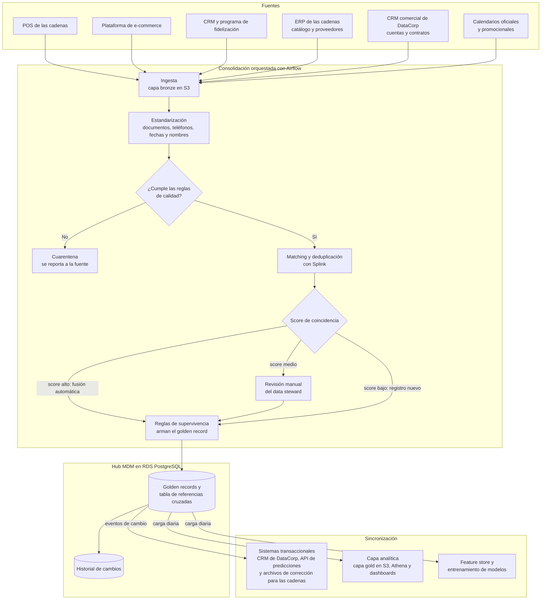

# Actividad 2: Implementación de MDM

DataCorp recibe datos de varias cadenas de retail y cada cadena los entrega desde sistemas distintos: puntos de venta (POS), tienda en línea, programa de fidelización y ERP. Un mismo cliente puede aparecer tres veces con códigos diferentes, un producto tiene un SKU distinto en cada cadena y cada fuente maneja su propia idea de qué es un cliente activo. Mientras eso siga así, los modelos se entrenan con datos que no cuadran entre sí. Por eso hay que definir qué datos maestros gestiona DataCorp y quién responde por cada uno.

El hub de MDM sigue un estilo de coexistencia. Las fuentes conservan sus propios registros, el hub construye el registro maestro (golden record) de cada entidad y lo publica hacia los sistemas que lo consumen. El hub vive en una base PostgreSQL sobre RDS y los procesos de consolidación se orquestan con Airflow, igual que el resto de pipelines del taller.

## 2.1 Entidades maestras

Cada entidad tiene un data owner, que es la persona de negocio que decide las definiciones y aprueba los cambios, y un data steward del equipo de datos, que vigila las reglas de calidad y resuelve los casos que la deduplicación automática no puede decidir.

| Entidad | Atributos principales | Fuentes | Reglas de calidad | Responsable (data owner) |
|---|---|---|---|---|
| Cliente (consumidor final de las cadenas) | `cliente_mdm_id`, tipo y número de documento, nombres, correo, teléfono, ciudad, fecha de nacimiento, autorización de tratamiento de datos y cadena a la que pertenece | POS, e-commerce, CRM y programa de fidelización de cada cadena | Documento único por tipo dentro de cada cadena. Correo con formato válido. Teléfono en formato internacional (+57...). Ningún par de registros con score de coincidencia mayor a 0,95 sin fusionar. Un registro sin autorización de tratamiento queda fuera de la analítica individual | Líder de Analítica de Clientes |
| Producto | `producto_mdm_id`, SKU de cada cadena, código de barras (GTIN), nombre, marca, categoría y subcategoría según la taxonomía única de DataCorp, unidad de medida y estado (activo o descontinuado) | ERP y catálogo de e-commerce de cada cadena, archivos que envían los proveedores | GTIN de 8, 12, 13 o 14 dígitos con dígito de control válido. Toda referencia mapeada a una categoría de la taxonomía. Unidad de medida dentro de la lista permitida | Líder de Catálogo y Taxonomía |
| Tienda (ubicación) | `tienda_mdm_id`, código de la tienda en la cadena, nombre, formato (hipermercado, supermercado, express u online), dirección, ciudad, país, coordenadas, fecha de apertura y fecha de cierre | ERP de las cadenas y CRM comercial de DataCorp | País con código ISO 3166 y ciudad con código DIVIPOLA del DANE en el caso de Colombia. Coordenadas dentro del país declarado. Fecha de cierre posterior a la de apertura. Cada tienda pertenece a una sola cuenta | Gerente de Customer Success |
| Proveedor | `proveedor_mdm_id`, NIT o identificación tributaria, razón social, país, categorías que abastece y tiempo promedio de entrega | Módulo de compras del ERP de las cadenas y archivos de los proveedores | NIT con dígito de verificación válido. Razón social normalizada (por ejemplo, "SAS", "S.A.S." y "S.A.S" se guardan igual). Tiempo de entrega mayor que cero | Líder de Analítica de Abastecimiento |
| Cuenta (cadena que contrata a DataCorp) | `cuenta_mdm_id`, NIT, razón social, país, plan contratado, fechas de inicio y fin del contrato y estado | CRM comercial y sistema de facturación de DataCorp | Un único registro por NIT. Estado "activa" solo con contrato vigente. Toda cuenta activa tiene por lo menos una tienda asociada | Director Comercial |
| Calendario comercial | Fecha, país, si es festivo y su nombre, temporada (escolar, prima de mitad de año, navidad) y eventos promocionales de cada cadena | Calendarios oficiales de festivos de cada país y calendario promocional que envía cada cadena | Todos los días del año cubiertos para cada país donde haya tiendas activas. Eventos promocionales de una misma cadena sin traslapes, a menos que estén marcados como combinados | Gerente de Customer Success, con apoyo del Líder de Ciencia de Datos |

Con la regla de cobertura del calendario, el fallo de la Actividad 1.3 se habría detectado antes. La falta de festivos para Perú y Ecuador habría salido como un problema de calidad del dato maestro, y no como un modelo que falla en QA.

## 2.2 Flujo de consolidación y sincronización



Componentes del flujo:

1. Las fuentes son los sistemas de las cadenas (POS, e-commerce, fidelización y ERP) y los sistemas propios de DataCorp. El hub no modifica ninguna: lee de ellas y, cuando encuentra errores, les devuelve las correcciones como sugerencia.
2. En la ingesta, Airflow trae los datos de cada fuente a la capa bronze de S3 tal como llegan, con la fecha de carga y el nombre de la fuente. Como esa copia no se toca, la consolidación se puede repetir si una regla cambia.
3. La estandarización lleva todos los registros a un mismo formato: documentos solo con dígitos, teléfonos en formato internacional, fechas en ISO 8601, nombres sin tildes duplicadas ni espacios de más y categorías de producto traducidas a la taxonomía de DataCorp.
4. Great Expectations valida los datos con las reglas de la tabla 2.1. Los registros que no las cumplen van a cuarentena y se reportan a la fuente. No entran al hub, para que un error de origen no contamine el registro maestro.
5. Para el matching y la deduplicación, Splink compara los registros entre fuentes y calcula un score de coincidencia. Con score mayor a 0,95 los registros se fusionan solos. Entre 0,80 y 0,95 pasan a la cola del data steward. Por debajo de 0,80 se tratan como entidades distintas.
6. Cuando varios registros representan la misma entidad, las reglas de supervivencia eligen qué valor queda en el golden record para cada atributo (sección 2.3).
7. El hub MDM guarda el golden record con su identificador único. Al lado está la tabla de referencias cruzadas, que relaciona ese identificador con el código que tiene la entidad en cada fuente: el `cliente_mdm_id` queda asociado al ID del POS, al usuario del e-commerce y al número de la tarjeta de fidelización. Con esa tabla se pueden unir fuentes que usan llaves distintas. Cada cambio queda en el historial.
8. En la sincronización, los sistemas transaccionales reciben los cambios como eventos casi en tiempo real. La capa analítica y el feature store reciben una carga diaria, con un snapshot versionado para que los modelos puedan reproducirse.

## 2.3 Políticas de gobernanza del dato maestro "Cliente"

### Definición de "cliente activo"

Un cliente es activo si tiene por lo menos una compra válida, en cualquier canal de la misma cadena, dentro de los 90 días anteriores a la fecha de corte del análisis. Una compra válida es una transacción que no fue anulada ni devuelta en su totalidad, y que no corresponde a una compra de empleado. La condición se evalúa por cadena: si una persona compra en dos cadenas, puede estar activa en una e inactiva en la otra.

La definición se guarda como un archivo versionado en el repositorio, para que cada modelo pueda registrar con qué versión se entrenó:

```yaml
# mdm/definiciones/cliente_activo.yaml
nombre: cliente_activo
version: 1.0.0
vigente_desde: 2026-10-01
responsable: Líder de Analítica de Clientes
descripcion: >
  Cliente con al menos una compra válida en cualquier canal de la misma
  cadena dentro de los 90 días anteriores a la fecha de corte.
ventana_dias: 90
canales: [pos, ecommerce]
excluye:
  - transacciones_anuladas
  - devoluciones_totales
  - compras_de_empleados
nivel: cadena
```

El indicador se calcula solo en el hub de MDM. Las fuentes pueden seguir midiendo su propia actividad, pero esas medidas se publican con otro nombre para que nadie las confunda con esta definición.

### Reglas de limpieza y deduplicación

Limpieza, antes de comparar registros:

- El número de documento se guarda sin puntos, guiones ni espacios, y el tipo de documento debe estar en la lista permitida (CC, CE, NIT, pasaporte y los equivalentes de cada país).
- El correo se pasa a minúsculas y se valida su formato. Los correos genéricos de tienda (por ejemplo, `cliente@cadena.com`, que usan algunos cajeros cuando el cliente no da el suyo) se marcan como inválidos.
- El teléfono se convierte al formato internacional E.164.
- Los nombres se pasan a mayúsculas, sin espacios dobles. Las tildes se conservan en el valor que se muestra, pero se quitan en la versión que se usa para comparar.
- Las fechas se convierten a ISO 8601. Una fecha de nacimiento que implique más de 110 años o menos de 14 se deja vacía.

Deduplicación: si dos registros de la misma cadena tienen el mismo tipo y número de documento, son el mismo cliente. Cuando falta el documento, Splink compara nombre, correo, teléfono y fecha de nacimiento y aplica los umbrales de la sección 2.2. Las fusiones nunca borran los registros de origen y se pueden deshacer: si el data steward detecta una fusión equivocada, la separa y el historial muestra quién lo hizo y por qué.

Reglas de supervivencia para armar el golden record:

| Atributo | Valor que se conserva |
|---|---|
| Documento | El que venga de una fuente que lo valida, como el programa de fidelización o la facturación electrónica |
| Nombre | El del registro con documento validado |
| Correo | El verificado más reciente |
| Teléfono | El más reciente con formato válido |
| Dirección | La más reciente que se haya usado en un pedido entregado |
| Autorización de datos | La más restrictiva. Si alguna fuente registra que el cliente revocó la autorización, esa revocación prevalece |

### Flujo de aprobación para cambios

Hay dos tipos de cambio y cada uno tiene su propio flujo.

Los cambios a registros individuales (corregir un correo, separar una fusión equivocada) los hace el data steward desde la herramienta del hub. No necesitan aprobación previa, pero quedan registrados con usuario, fecha, valor anterior y motivo. Cada mes el data owner revisa una muestra de esos cambios.

Los cambios a las definiciones o a las reglas (por ejemplo, pasar la ventana de cliente activo de 90 a 60 días) siguen estos pasos:

1. Quien propone el cambio abre un pull request que modifica el archivo de la definición o de la regla y explica el motivo.
2. El data steward hace el análisis de impacto: qué modelos, dashboards y reportes usan esa definición y cuánto cambian sus cifras con la versión nueva. El resultado se adjunta al pull request.
3. Aprueban el data owner de Cliente y el Líder de Ciencia de Datos. Si el cambio afecta lo que ven las cadenas en sus reportes, también aprueba el Gerente de Customer Success.
4. Al fusionarse, la definición recibe un número de versión nuevo y una fecha de vigencia. La versión anterior queda en el historial de Git.
5. Se avisa a los equipos afectados y se reentrenan los modelos que dependen de la definición, siguiendo el flujo normal de DEV, QA y PROD de la Actividad 1.

### Políticas de acceso y seguridad

Nombre, documento, correo, teléfono, dirección y fecha de nacimiento son datos personales (PII) y se clasifican como restringidos. El acceso depende del rol:

| Rol | Acceso al dato maestro Cliente |
|---|---|
| Data steward de clientes | Lectura y edición de golden records desde la herramienta del hub. Cada edición queda auditada |
| Ingeniería de datos | Solo a través de las cuentas de servicio de los pipelines. Las personas no editan registros directamente en la base |
| Ciencia de datos | Vista seudonimizada: identificador cifrado y atributos sin PII, como ciudad, rango de edad y antigüedad como cliente |
| Analistas de BI | Datos agregados. Nunca registros individuales |
| Cadenas de retail | Solo sus propios clientes, con seguridad a nivel de fila por `cuenta_mdm_id` |

Además de los roles:

- La PII se cifra en reposo con AWS KMS y en tránsito con TLS.
- DEV y QA reciben únicamente la vista enmascarada, como se definió en la Actividad 1.
- Los accesos quedan registrados en CloudTrail y los permisos se revisan cada trimestre.
- Las consultas y reclamos de los titulares bajo la Ley 1581 de 2012, cuando piden conocer, actualizar o suprimir sus datos, se atienden en el hub. La ley da 10 días hábiles para las consultas y 15 para los reclamos. La corrección o supresión llega a todos los sistemas por el mismo mecanismo de sincronización de la sección 2.2.
- Los registros de clientes sin compras en cinco años se anonimizan.

## 2.4 Conflicto entre dos definiciones de "cliente activo"

### Situación

Antes del MDM, DataCorp tomaba el número de clientes activos de una cadena ficticia, Almacenes Cordillera, desde dos fuentes que lo calculaban de forma distinta:

| Fuente | Qué considera "cliente activo" | Clientes activos reportados |
|---|---|---|
| Plataforma de e-commerce | Inició sesión en los últimos 30 días | 48.200 |
| Programa de fidelización | Tiene la tarjeta de fidelización vigente (renovada en los últimos 12 meses) | 81.700 |

El modelo de predicción de ventas usa como variable el número de clientes activos por tienda. En junio se entrenó con la cifra del e-commerce. En septiembre, por un cambio en el feed del e-commerce, el equipo la tomó del programa de fidelización sin dejarlo registrado. La variable subió cerca de 70 % de un día para otro y las predicciones cambiaron aunque los hiperparámetros eran los mismos. Nadie pudo reproducir los resultados de junio. Al mismo tiempo, el dashboard que ve la cadena mostraba la cifra de fidelización y el informe del modelo la del e-commerce, y la cadena preguntó cuál de las dos era la correcta.

El mismo cliente podía quedar clasificado de forma opuesta según la fuente:

| Cliente | Situación real | E-commerce | Fidelización | Definición MDM |
|---|---|---|---|---|
| C-1024 | Compró en tienda física hace 40 días, entró a la web por última vez hace 75 días y tiene la tarjeta vigente | Inactivo | Activo | Activo |
| C-2311 | Entró a la web hace 5 días pero no compra hace 8 meses, y su tarjeta venció | Activo | Inactivo | Inactivo |
| C-3870 | Compra seguido en línea y nunca se afilió al programa | Activo | Inactivo | Activo |

### Cómo lo resuelve MDM

1. Detección. El pipeline de MDM concilia las cifras de cada fuente. Una diferencia mayor al 10 % genera una alerta para el data steward de clientes.
2. Inventario. El data steward documenta las dos definiciones y lista en qué modelos y dashboards aparece cada una.
3. Decisión. El data owner de Cliente, el Líder de Ciencia de Datos y el Gerente de Customer Success acuerdan la definición corporativa de la sección 2.3 (compra válida en cualquier canal en los últimos 90 días) y la publican como versión 1.0.0.
4. Separación de conceptos. Las medidas de cada fuente siguen existiendo porque sirven para otros análisis, pero se renombran como `usuario_digital_activo_30d` y `miembro_fidelizacion_vigente`. Ninguna de las dos se vuelve a llamar "cliente activo".
5. Cálculo centralizado. El hub calcula el indicador a partir de las compras de todos los canales, unidas por `cliente_mdm_id` gracias a la tabla de referencias cruzadas. Para Almacenes Cordillera el resultado es 76.400 clientes activos. Esa es la cifra que ahora usan tanto el modelo como el dashboard que ve la cadena.
6. Recálculo del histórico. Se recalcula el indicador hacia atrás con la versión 1.0.0, se guarda un snapshot versionado con DVC y el modelo se reentrena con esos datos siguiendo el flujo de la Actividad 1.

### Impacto en la replicabilidad de los modelos

Con la definición en el hub, cada entrenamiento registra en MLflow tres datos: el commit del código, el hash de DVC de los datos y la versión de la definición de cliente activo (por ejemplo, `cliente_activo@1.0.0`). Con esos tres valores el modelo se puede volver a entrenar meses después y obtener las mismas variables y las mismas métricas.

Si en 2027 la ventana cambia a 60 días, la definición pasa a la versión 2.0.0, pero los modelos entrenados con la 1.0.0 se siguen pudiendo reproducir, porque el archivo de esa versión queda en el historial de Git y el snapshot en DVC. Cuando se compare un modelo entrenado con la versión 1.0.0 contra uno entrenado con la 2.0.0, el equipo sabrá que parte de la diferencia viene del cambio de definición y no del modelo. En septiembre eso no se pudo saber, porque el cambio de fuente no quedó registrado en ningún lado.
