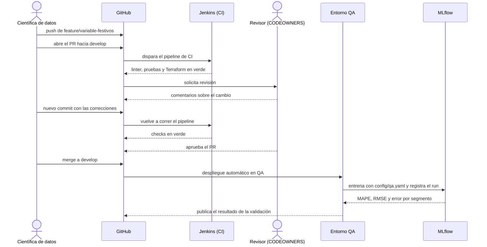

# Actividad 3: Control de versiones para todo

El modelo de predicción de ventas depende del código de Python, pero también de la consulta SQL que trae los datos, de los umbrales de cada entorno, de la definición de cliente activo, del DAG que lo entrena, de la infraestructura donde corre y de los datos con los que se entrenó. Si una de esas piezas cambia sin quedar registrada, el modelo ya no se puede reproducir, que fue justo lo que pasó en el caso de la Actividad 2.4. Por eso este repositorio guarda en Git todo lo que es texto y define el sistema. Para los datos guarda punteros y documentación de procedencia.

## 3.1 Estructura del repositorio

```
datacorp-dataops-taller-practico-ENDO-/
├── README.md
├── .gitignore
├── requirements.txt              # dependencias con versión fija
├── pyproject.toml                # configuración de pytest y ruff
├── dvc.yaml                      # etapas del pipeline de datos para DVC
├── .dvc/
│   └── config                    # remoto de DVC en S3
├── .github/
│   ├── CODEOWNERS                # quién aprueba los cambios de cada carpeta
│   └── pull_request_template.md  # lista de revisión de cada pull request
├── src/
│   ├── ingesta/extraer_ventas.py
│   ├── calidad/validar_datos.py
│   ├── features/construir_features.py
│   └── modelos/entrenar.py
├── notebooks/
│   └── 01_exploracion_ventas.py  # notebook exportado con jupytext
├── sql/
│   ├── consultas/ventas_diarias_por_tienda.sql
│   └── migrations/
│       ├── V001__crear_tabla_features_ventas.sql
│       ├── V002__agregar_columna_es_festivo.sql
│       └── U002__agregar_columna_es_festivo.sql
├── config/
│   ├── dev.yaml
│   ├── qa.yaml
│   ├── prod.yaml
│   └── modelo_ventas.json
├── mdm/
│   └── definiciones/cliente_activo.yaml
├── pipelines/
│   ├── airflow/dags/dag_entrenamiento_ventas.py
│   └── jenkins/Jenkinsfile
├── infra/
│   └── terraform/
│       ├── versions.tf
│       └── variables.tf
├── data/
│   ├── raw/
│   │   ├── ventas.csv.dvc
│   │   └── calendario_comercial.csv.dvc
│   └── procedencia/
│       ├── ventas.yaml
│       └── calendario_comercial.yaml
├── tests/
│   ├── test_calidad_datos.py
│   ├── test_features.py
│   └── test_umbrales.py
├── docs/
└── evidencias/
```

Así quedan cubiertos los tipos de artefacto que pide la actividad:

| Lo que pide la actividad | Dónde está |
|---|---|
| Scripts de Python | `src/` (extracción, validación de calidad, construcción de variables y entrenamiento) y sus pruebas en `tests/` |
| Notebooks exportados | `notebooks/01_exploracion_ventas.py` |
| SQL | `sql/consultas/` y `sql/migrations/` |
| Configuraciones YAML y JSON | `config/dev.yaml`, `config/qa.yaml`, `config/prod.yaml`, `config/modelo_ventas.json` y `mdm/definiciones/cliente_activo.yaml` |
| Definiciones de pipeline | `pipelines/airflow/dags/dag_entrenamiento_ventas.py`, `pipelines/jenkins/Jenkinsfile` y `dvc.yaml` |
| Definiciones de infraestructura | `infra/terraform/` |
| Documentación de procedencia de datos | `data/procedencia/` y los punteros `data/raw/*.dvc` |

### Decisiones sobre la estructura

La configuración está separada del código. Los mismos scripts corren en DEV, QA y PROD, y lo único que cambia es el YAML del entorno. Los umbrales de la Actividad 1.3 (MAPE máximo de 15 % y un punto de tolerancia frente al modelo en producción) viven en `config/qa.yaml`, así que subir o bajar un umbral es un commit que pasa por revisión, igual que un cambio de código.

El notebook se guarda como `.py` con jupytext. Un `.ipynb` es un JSON que cambia cada vez que se ejecuta, aunque el código sea el mismo, y sus salidas pueden incluir filas de datos. En formato `.py` el diff muestra solo las líneas de código que cambiaron.

Las migraciones SQL llevan número de versión (`V001`, `V002`) y la `V002` tiene su reversa (`U002`). Eso es lo que permite el rollback de la etapa de migraciones descrita en la Actividad 1.2. La consulta de ventas usa los identificadores del hub MDM y recibe como parámetro la versión de la definición de cliente activo, lo que conecta el código con la Actividad 2.

Las pruebas incluyen dos casos de las actividades anteriores. `test_umbrales.py` comprueba que el candidato con MAPE de 18,7 % frente a 12,9 % en producción sea rechazado, y `test_features.py` comprueba que la construcción de variables falle si el calendario no tiene festivos para un país. Si alguien afloja un umbral o quita la regla del calendario, esas pruebas fallan en el pipeline.

Terraform y Jenkins están en su versión inicial. `infra/terraform/` solo tiene la configuración del proveedor y del estado remoto, y los recursos de AWS se agregan en la Actividad 4. El Jenkinsfile solo tiene integración continua (dependencias, linter, pruebas y validación de Terraform), y en la Actividad 5 se le agregan las etapas de entrega continua. Así el historial de Git va a mostrar cómo crece cada archivo.

Los md5, el commit y el número de filas que aparecen en `data/procedencia/` y en los punteros `.dvc` son ilustrativos, porque los datos del caso son simulados. En un repositorio real los calcula DVC al ejecutar `dvc add`.

## 3.2 Qué se versiona y qué no

La actividad pide esta explicación en un README.md, así que está en el [README principal](../README.md), en la sección de la Actividad 3. Ahí también está la parte sobre el versionado de la procedencia de datos.

## 3.3 Simulación de un commit y un pull request

### El cambio

Se toma el ejemplo de la Actividad 1.2: una científica de datos agrega al modelo de predicción de ventas la variable que indica si el día es festivo. El cambio toca cuatro partes del repositorio: la construcción de variables (`src/features/construir_features.py`), la lista de variables del modelo (`config/modelo_ventas.json`), la migración que agrega la columna con su reversa (`sql/migrations/V002` y `U002`) y las pruebas (`tests/test_features.py`).

### El commit

```bash
git checkout develop
git pull origin develop
git checkout -b feature/variable-festivos

# ... cambios en los archivos ...

pytest -q
ruff check src tests pipelines

git add src/features/construir_features.py config/modelo_ventas.json \
        sql/migrations/V002__agregar_columna_es_festivo.sql \
        sql/migrations/U002__agregar_columna_es_festivo.sql \
        tests/test_features.py
git commit -m "feat: agregar variable es_festivo al modelo de ventas" \
           -m "Une las ventas con el calendario comercial del hub MDM por fecha y país.
Agrega la migración V002 y su reversa U002. La construcción de variables
falla si el calendario no cubre algún país (regla de la Actividad 2.1)."
git push -u origin feature/variable-festivos
```

Antes del commit se corren las pruebas y el linter en local, para no esperar a que falle el pipeline. El mensaje sigue la convención de Conventional Commits: un resumen corto con el tipo de cambio, en imperativo, y un cuerpo que explica qué se hizo y por qué. Un commit agrupa un solo cambio lógico. En este repositorio se usan estos tipos:

| Tipo | Uso | Ejemplo en este repositorio |
|---|---|---|
| `feat` | Funcionalidad o artefacto nuevo | `feat: configuración base de Terraform` |
| `fix` | Corrección de un error | `fix: excluir devoluciones del cálculo de ventas` |
| `ci` | Cambios en pipelines de CI/CD | `ci: DAG de Airflow y Jenkinsfile inicial` |
| `docs` | Documentación | `docs: actividad 2 - implementación de MDM` |
| `chore` | Mantenimiento que no cambia el comportamiento | `chore: quitar .DS_Store del repositorio` |
| `test` | Pruebas nuevas o corregidas | `test: caso de calendario sin festivos para Perú` |

Los commits de esta misma actividad están separados por tipo de artefacto (código, configuración, pipelines, infraestructura, datos y plantillas de GitHub), así que cada uno se puede revisar o revertir por separado.

### El pull request

La científica abre el pull request de `feature/variable-festivos` hacia `develop`. GitHub llena la descripción con la plantilla de `.github/pull_request_template.md`, que pide marcar el tipo de cambio y una lista de revisión: pruebas y linter en verde, procedencia actualizada si cambiaron los datos, análisis de impacto si cambió una definición de MDM, salida de `terraform plan` si cambió la infraestructura, y ningún archivo de datos, credencial o `.ipynb` dentro del cambio. El archivo `.github/CODEOWNERS` asigna los revisores según las carpetas que toca el cambio.

### Flujo de revisión e integración con QA



1. Al abrir el PR, Jenkins ejecuta el pipeline de CI y publica el resultado como un check del PR. Si el check está en rojo, la regla de protección de la rama impide el merge.
2. CODEOWNERS pide la revisión. El revisor lee el diff y comprueba que las pruebas cubran el cambio, que la migración tenga reversa y que no entren datos ni credenciales. Los comentarios quedan en las líneas del diff.
3. La autora responde con commits nuevos en la misma rama. El PR se actualiza solo y el pipeline corre otra vez. No se reescribe el historial de una rama que ya está en revisión.
4. Con el check en verde, la aprobación y todas las conversaciones resueltas, se hace el merge a `develop` con un merge commit. Así queda en el historial que el cambio entró por ese PR.
5. El merge a `develop` dispara el despliegue en QA. Ahí se aplican las migraciones sobre la copia anonimizada, el DAG entrena el modelo con `config/qa.yaml` y se valida contra los umbrales y el error por segmento. MLflow guarda el run con el commit, el md5 de los datos y la versión de la definición de cliente activo.
6. Si QA aprueba, el cambio sigue hacia producción con el pull request de `develop` a `main` (Actividad 1.2). Si falla, se revierte el merge en `develop` y se corrige en la rama feature (Actividad 1.3).

### Reglas de protección de las ramas

| Rama | Reglas |
|---|---|
| `main` | Pull request obligatorio, una aprobación de CODEOWNERS, checks de CI y de validación en QA en verde, conversaciones resueltas y sin push directo ni force push |
| `develop` | Pull request obligatorio, una aprobación y check de CI en verde |

Los pull requests de este taller siguen el mismo recorrido: rama `feature/actividad-N`, PR hacia `develop` y merge. Frente al flujo descrito faltan dos cosas, porque es un trabajo individual sin infraestructura: un servidor de Jenkins conectado que publique los checks y un segundo revisor, ya que GitHub no deja aprobar un PR propio.
