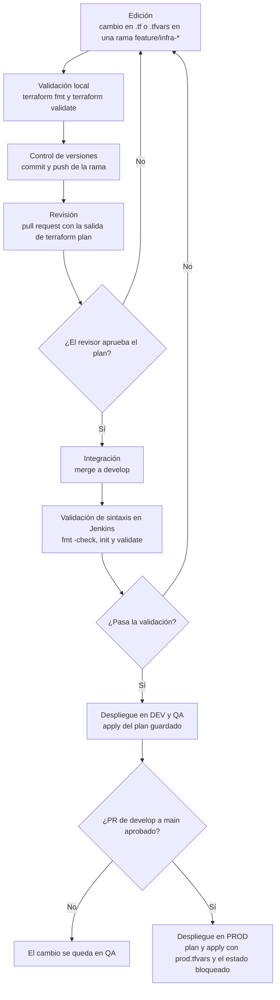

# Actividad 4: Infraestructura como Código (IaC)

Cuando los entornos se configuran a mano desde la consola de AWS, cada uno termina un poco distinto: alguien cambia el tamaño de una base en QA, otra persona abre un puerto en DEV para probar algo, y después nadie sabe por qué una prueba que pasó en QA falla en PROD. Con Terraform, la infraestructura de DataCorp queda escrita en archivos de texto que se versionan, se revisan y se aplican igual que el código del modelo. El código está en [infra/terraform](../infra/terraform).

## 4.1 Archivos de Terraform

| Archivo | Contenido |
|---|---|
| `versions.tf` | Versión mínima de Terraform (1.11), proveedor de AWS (6.x) y estado remoto en S3 con bloqueo |
| `variables.tf` | Variables de entrada, con validaciones que impiden configuraciones peligrosas |
| `main.tf` | Los recursos: bucket S3, rol IAM, estaciones EC2 y base RDS |
| `outputs.tf` | Datos que Terraform muestra al terminar: bucket, ARN del rol, IDs de las estaciones y endpoint de la base |
| `envs/dev.tfvars`, `envs/qa.tfvars`, `envs/prod.tfvars` | Lo único que cambia entre entornos |
| `.terraform.lock.hcl` | Versión exacta y checksums del proveedor de AWS |

Un solo `main.tf` crea los tres entornos. Cada recurso que pide la actividad queda en el entorno que le corresponde según su archivo `.tfvars`:

| Recurso pedido | Bloque en `main.tf` | Dónde se crea |
|---|---|---|
| Bucket S3 para datos de staging | `aws_s3_bucket.datos` | Todos los entornos tienen su bucket. En QA se llama `datacorp-staging` |
| Instancia EC2 para DEV | `aws_instance.desarrollo` | Solo en DEV, donde `cantidad_instancias_dev = 3` (una por científico de datos) |
| Base de datos RDS para PROD | `aws_db_instance.principal` | En QA y PROD. En PROD es Multi-AZ, tiene protección contra borrado y guarda 14 días de respaldos |
| Rol IAM con permisos restringidos | `aws_iam_role.pipeline` y su política | Uno por entorno, y cada uno solo puede usar el bucket de su propio entorno |

### Los cuatro recursos

El bucket toma su nombre del entorno. Además tiene versionado de objetos, cifrado con KMS y bloqueo de acceso público, cada uno en su propio bloque de `main.tf`:

```hcl
resource "aws_s3_bucket" "datos" {
  bucket = local.nombres_bucket[var.entorno]
}
```

El rol IAM solo puede listar, leer y escribir en el bucket de su entorno. La tercera regla niega de forma explícita el borrado: aunque alguien le agregue después otra política más amplia, en IAM una negación explícita siempre gana.

```hcl
data "aws_iam_policy_document" "acceso_bucket" {
  statement {
    sid       = "ListarSoloSuBucket"
    actions   = ["s3:ListBucket"]
    resources = [aws_s3_bucket.datos.arn]
  }

  statement {
    sid       = "LeerYEscribirObjetos"
    actions   = ["s3:GetObject", "s3:PutObject"]
    resources = ["${aws_s3_bucket.datos.arn}/*"]
  }

  statement {
    sid       = "SinBorradoDeDatos"
    effect    = "Deny"
    actions   = ["s3:DeleteObject", "s3:DeleteObjectVersion", "s3:DeleteBucket"]
    resources = [aws_s3_bucket.datos.arn, "${aws_s3_bucket.datos.arn}/*"]
  }
}
```

Las estaciones EC2 se crean con `count`, así que en QA y PROD, donde la cantidad es 0, no existen. Usan la última imagen de Amazon Linux 2023, tienen el disco cifrado, exigen IMDSv2 para leer los metadatos de la instancia y llevan una etiqueta que usa el programador de apagado fuera del horario laboral (Actividad 1.1).

```hcl
resource "aws_instance" "desarrollo" {
  count = var.cantidad_instancias_dev

  ami                  = data.aws_ami.amazon_linux.id
  instance_type        = var.tipo_instancia_dev
  subnet_id            = data.aws_subnets.principal.ids[0]
  iam_instance_profile = aws_iam_instance_profile.pipeline.name
  # ... disco cifrado, IMDSv2 y etiquetas
}
```

La base RDS es PostgreSQL 16. La contraseña del usuario administrador la genera AWS y la guarda en Secrets Manager con `manage_master_user_password`, así que no aparece en el código, en los `.tfvars` ni en el repositorio. La base no es pública y solo acepta conexiones desde la VPC por el puerto 5432.

```hcl
resource "aws_db_instance" "principal" {
  count = var.crear_rds ? 1 : 0

  identifier     = "${local.prefijo}-ventas"
  engine         = "postgres"
  engine_version = "16"
  instance_class = var.clase_rds

  manage_master_user_password = true

  storage_encrypted   = true
  multi_az            = var.rds_multi_az
  publicly_accessible = false
  deletion_protection = var.proteccion_borrado
  # ... almacenamiento, red y respaldos
}
```

### Validaciones en las variables

Algunas reglas de la Actividad 1 quedaron como validaciones en `variables.tf`, así que Terraform se niega a seguir si alguien las incumple:

- Las estaciones EC2 solo se pueden crear en el entorno `dev`.
- En `prod` la base tiene que ser Multi-AZ y tener protección contra borrado.
- La retención de respaldos debe estar entre 1 y 35 días, que es el rango que acepta RDS.

Estas validaciones se probaron con configuraciones inválidas a propósito: un `prod.tfvars` con `rds_multi_az = false` y un `qa.tfvars` con estaciones EC2. En los dos casos Terraform se detuvo con el mensaje de error definido en la validación.

El código no se aplicó en una cuenta real de AWS, porque el taller no tiene credenciales ni presupuesto para eso. Sí se validó en local con Terraform 1.12.2: el formato pasa `terraform fmt -check` y la sintaxis pasa `terraform validate` (ver la evidencia en el README). Los nombres de bucket como `datacorp-staging` tendrían que cambiarse en una cuenta real, porque los nombres de S3 son únicos en todo AWS.

## 4.2 Replicar entornos idénticos

Un archivo de Terraform describe el estado final que se quiere (qué recursos existen y con qué configuración), no los pasos para llegar a él. Terraform compara esa descripción con lo que hay en AWS y hace solo los cambios necesarios. Por eso, aplicar el mismo código dos veces deja la infraestructura igual, y aplicarlo en una cuenta vacía crea el entorno completo desde cero.

Varias decisiones del código hacen que los entornos salgan idénticos:

1. DEV, QA y PROD comparten el mismo `main.tf`. Las diferencias entre entornos están en los tres archivos `.tfvars` y se pueden leer en un minuto. Si QA tiene la misma arquitectura que PROD, es porque literalmente es el mismo código con otros números.
2. Cada entorno tiene su propio workspace y, con él, su propio estado. Con el backend de S3, el estado de QA queda en `env:/qa/dataops/terraform.tfstate` y el de PROD en `env:/prod/dataops/terraform.tfstate`, así que un `apply` en QA no puede tocar PROD.
3. Las versiones están fijadas: Terraform 1.11 o superior en `versions.tf`, el proveedor de AWS en la serie 6.x y la versión exacta del proveedor en `.terraform.lock.hcl`. El mismo código aplicado dentro de seis meses se comporta igual.
4. El estado vive en S3, cifrado y con bloqueo (`use_lockfile = true`). Si dos personas o dos ejecuciones de Jenkins intentan aplicar al mismo tiempo, la segunda espera, y nadie trabaja con una copia vieja del estado.
5. Nadie cambia la infraestructura desde la consola. Si alguien lo hace, el siguiente `terraform plan` muestra la diferencia entre el código y lo que hay en AWS, y el cambio manual se revierte o se pasa al código.

Con los archivos actuales, cada entorno crea 10 recursos:

| Entorno | S3 | IAM | EC2 | RDS | Total |
|---|---|---|---|---|---|
| DEV | 4 (bucket, versionado, cifrado y bloqueo público) | 3 (rol, política y perfil de instancia) | 3 estaciones | 0 | 10 |
| QA | 4 | 3 | 0 | 3 (grupo de subredes, grupo de seguridad y base) | 10 |
| PROD | 4 | 3 | 0 | 3, con una base más grande y Multi-AZ | 10 |

### Comandos para aplicar los cambios

Así se aplica un cambio en QA. Para los demás entornos solo cambian el nombre del workspace y el archivo `.tfvars`:

```bash
cd infra/terraform

# 1. Descargar el proveedor y conectar el estado remoto en S3
terraform init

# 2. Elegir el entorno; cada workspace tiene su propio estado
terraform workspace select -or-create qa

# 3. Revisar formato y sintaxis
terraform fmt -check -recursive
terraform validate

# 4. Ver qué va a cambiar, sin tocar nada todavía, y guardar el plan
terraform plan -var-file=envs/qa.tfvars -out=qa.tfplan

# 5. Aplicar exactamente el plan que se revisó
terraform apply qa.tfplan
```

El paso 4 es el que se revisa en el pull request: el plan dice qué recursos se van a crear, modificar o destruir. Guardarlo con `-out` y aplicarlo en el paso 5 garantiza que se aplique lo mismo que se aprobó, aunque alguien haya cambiado algo en el medio.

Otros comandos que se usan con frecuencia:

| Comando | Para qué |
|---|---|
| `terraform plan -var-file=envs/prod.tfvars -detailed-exitcode` | Detectar cambios manuales en PROD. Termina con código 2 si la infraestructura real no coincide con el código |
| `terraform output` | Ver el bucket, el ARN del rol o el endpoint de la base después de aplicar |
| `terraform destroy -var-file=envs/dev.tfvars` | Eliminar un entorno temporal, como el entorno de preview de la Actividad 1.2 |

Un ejemplo de lo que esto cambia en el día a día: cuando llega un científico de datos nuevo, alguien sube `cantidad_instancias_dev` de 3 a 4 en `envs/dev.tfvars` con un pull request. Al aplicarse, Terraform crea una cuarta estación con la misma imagen, el mismo rol y el mismo cifrado que las otras tres. El entorno de la persona nueva queda listo en minutos y es igual al de sus compañeros.

## 4.3 Flujo de trabajo de IaC



1. Edición. El cambio se hace en una rama `feature/infra-...`, en VS Code con la extensión de Terraform, que marca los errores de sintaxis mientras se escribe. Antes de hacer commit se corren `terraform fmt` y `terraform validate` en local.
2. Control de versiones. Commit y push de la rama, con un mensaje que explique el cambio. Nadie aplica cambios a QA o PROD desde su propio computador: las credenciales para eso solo las tiene Jenkins.
3. Revisión. Se abre el pull request y Jenkins publica como comentario la salida de `terraform plan` para cada entorno afectado. CODEOWNERS pide la revisión de quien responde por `/infra/`. El revisor lee el código y, sobre todo, el plan: cualquier recurso marcado para destruir o reemplazar (por ejemplo, una base de datos) se discute antes de aprobar.
4. Integración. Con la aprobación, el cambio se fusiona en `develop`.
5. Validación de sintaxis. Jenkins vuelve a correr la etapa "Validar Terraform" del Jenkinsfile (`fmt -check`, `init` y `validate`) sobre el código ya integrado. La misma etapa corrió también cuando se abrió el pull request, así que aquí un fallo es raro, pero se repite porque es el código que se va a desplegar.
6. Despliegue. Jenkins aplica el cambio en DEV y luego en QA, cada uno con su workspace y su `.tfvars`. PROD solo cambia cuando se aprueba el pull request de `develop` a `main`: ahí Jenkins genera el plan de PROD, lo aplica con el estado bloqueado y guarda la salida de `terraform output`. Las etapas de plan y apply se agregan al Jenkinsfile en la Actividad 5.
