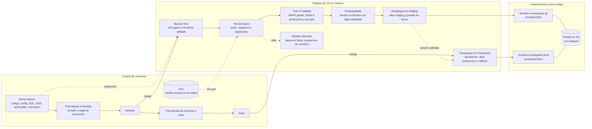

# Actividad 5: Continuous Delivery para DataOps

El modelo de predicción de ventas llega a producción por un solo camino: el pipeline definido en [pipelines/jenkins/Jenkinsfile](../pipelines/jenkins/Jenkinsfile). Cada etapa tiene un criterio que debe cumplirse para pasar a la siguiente, y si una falla, el pipeline se detiene sin tocar lo que ya está en producción. Nadie entrena un modelo en su computador y lo sube a mano.

## 5.1 Pipeline de CD del modelo de predicción de ventas

| Etapa | Qué hace | En qué rama corre |
|---|---|---|
| Build & Test | Instala las dependencias fijadas, corre el linter y las pruebas, y en paralelo valida el código de Terraform | Todas, incluidas las ramas `feature/*` y los pull requests |
| Test de Datos | Trae con DVC la versión de los datos que corresponde al commit y revisa su calidad | `develop` |
| Train & Validate | Construye las variables, entrena el modelo y lo compara con los umbrales, con el modelo en producción y por país | `develop` |
| Empaquetado | Registra el modelo en MLflow como una versión nueva con el alias `candidato` | `develop` |
| Despliegue en Staging | Aplica Terraform en QA, migra la base de QA, pasa el alias `staging` a la versión nueva y corre una prueba de humo | `develop` |
| Despliegue en Producción | Pide la aprobación del líder técnico, aplica Terraform en PROD, respalda la base, la migra, pasa el alias `produccion` a la versión de Staging y corre la prueba de humo | `main` |

Tres decisiones definen cómo funciona el pipeline:

- En `main` no se vuelve a entrenar. La etapa de Producción promueve la misma versión que se validó en Staging, así que lo que llega a PROD es exactamente lo que se probó, y no un modelo nuevo entrenado con los datos de otro día.
- Desplegar un modelo es mover un alias en el registro de MLflow. El código que hace predicciones siempre carga `models:/modelo_ventas@produccion`, de modo que cambiar de versión, o volver a la anterior, toma segundos y no necesita reconstruir nada.
- El pipeline también despliega la infraestructura. Antes de tocar el modelo, cada etapa de despliegue aplica Terraform con el `.tfvars` de su entorno (Actividad 4), así que el modelo nunca llega a una infraestructura distinta de la que está en el código.

Las etapas usan los scripts del repositorio: `src/calidad/validar_datos.py`, `src/features/construir_features.py`, `src/modelos/entrenar.py` y `src/modelos/registro.py`. Este último maneja el registro de modelos en MLflow. El recorrido completo, desde el entrenamiento hasta la promoción a producción, se probó con MLflow 3.16 en local.

## 5.2 Herramientas, criterios de éxito y acciones en caso de fallo

| Etapa | Herramientas | Criterios de éxito | Acciones en caso de fallo |
|---|---|---|---|
| Build & Test | Jenkins, pip con `requirements.txt`, ruff, pytest, Terraform (`fmt` y `validate`) | Dependencias instaladas, linter sin errores, las 14 pruebas en verde y Terraform con formato y sintaxis correctos | El check del pull request queda en rojo y la regla de protección impide el merge. Llega una alerta a Slack y el autor corrige en su rama |
| Test de Datos | DVC, `src/calidad/validar_datos.py` | Están todas las columnas que espera el modelo, ninguna supera 10 % de nulos, no hay ventas negativas ni filas duplicadas por fecha y tienda | El pipeline se detiene antes de entrenar. Ingeniería de datos revisa la fuente, corrige el problema y genera un snapshot nuevo con DVC (ver 5.3) |
| Train & Validate | XGBoost, MLflow Tracking, `construir_features.py` y `entrenar.py` | MAPE de máximo 15 %, no más de un punto por encima del modelo en producción y ningún país por encima de 20 %. El run queda en MLflow con el commit, el md5 de los datos y la versión de la definición de cliente activo | El modelo se rechaza y no se registra. El run se queda en MLflow para analizarlo, y el autor sigue el protocolo de la Actividad 1.3: reproduce el entrenamiento en DEV y corrige antes de volver a intentarlo |
| Empaquetado | MLflow Model Registry, `registro.py registrar` | Existe una versión nueva de `modelo_ventas` con el alias `candidato`, con sus dependencias, un ejemplo de entrada y las etiquetas de trazabilidad | No se crea la versión y nada se despliega. Si el error fue de conexión con MLflow, se reintenta la ejecución |
| Despliegue en Staging | Terraform (workspace `qa`), Flyway, `registro.py promover` y `verificar` | Terraform aplica sin errores, las migraciones quedan aplicadas, el alias `staging` apunta a la versión nueva y la prueba de humo devuelve predicciones sin nulos ni valores negativos | El alias `staging` no cambia o se devuelve. Se revierte el merge en `develop` para que QA vuelva a su último estado estable, y el cambio se corrige en la rama feature |
| Despliegue en Producción | Aprobación manual en Jenkins (`input`), Terraform (workspace `prod`), AWS CLI para el snapshot de RDS, Flyway, `registro.py` | Aprobación registrada del líder técnico, snapshot de la base disponible antes de migrar, migraciones aplicadas, alias `produccion` en la versión de Staging y prueba de humo correcta. En las primeras horas se vigilan errores, latencia y distribución de las predicciones | Si la prueba de humo falla, el pipeline devuelve el alias `produccion` a la versión `anterior` de forma automática. Si falla una migración, se aplica su reversa (`U002`) o se restaura el snapshot. Después del incidente se escribe un postmortem |

## 5.3 Simulación: falla el Test de Datos

### Situación

El lunes, el snapshot nuevo de ventas que trae el pipeline tiene 15 % de nulos en la columna `clientes_activos`. La causa es que tres tiendas abrieron esa semana y todavía no están en la tabla de referencias cruzadas del hub MDM. Por eso la consulta de ventas no encuentra su número de clientes activos y el `LEFT JOIN` las deja vacías. El máximo permitido es 10 % (`calidad.max_nulos_pct` en `config/qa.yaml`).

### Cómo se simuló

En el repositorio hay dos archivos de prueba en `tests/datos/`. `ventas_validas.csv` tiene 20 filas completas, y `ventas_con_nulos.csv` tiene las mismas 20 filas pero 3 sin `clientes_activos`, que es el 15 %. El script `pipelines/simular_cd.sh` recorre las seis etapas en el orden del Jenkinsfile. Las dos primeras se ejecutan de verdad, con el mismo código que usa Jenkins, y las demás se describen porque necesitan MLflow y AWS. Igual que en Jenkins, si una etapa falla, las siguientes no corren.

Con el archivo válido el pipeline llega hasta el final. Con el archivo de nulos, esta fue la salida:

```
=== Etapa 1/6: Build & Test ===
All checks passed!
..............                                                           [100%]
14 passed

=== Etapa 2/6: Test de Datos ===
Validación fallida:
  - clientes_activos: 15.0 % de nulos (máximo permitido 10 %)

PIPELINE DETENIDO en la etapa 2: Test de Datos
Etapas que no se ejecutan:
  - Train & Validate
  - Empaquetado
  - Despliegue en Staging
  - Despliegue en Producción
El modelo no se empaqueta ni se despliega. Producción sigue con la versión que tenía.
```

El script termina con código de salida 1, que es lo que en Jenkins pone la ejecución en rojo y detiene las etapas siguientes. Las capturas de las dos ejecuciones están en las evidencias del README.

### Protocolo de actuación

1. Detección. El script de validación encuentra 15 % de nulos en `clientes_activos`, imprime el detalle y termina con código 1. Jenkins marca la etapa Test de Datos en rojo.
2. Bloqueo. Jenkins no ejecuta las etapas siguientes, así que no se entrena ningún modelo, no se registra una versión nueva en MLflow y los alias `staging` y `produccion` siguen donde estaban. PROD sigue sirviendo el modelo de siempre.
3. Notificación. El bloque `post { failure }` del Jenkinsfile envía una alerta al canal `#dataops-alertas` de Slack con el enlace a la ejecución, donde está el mensaje con la columna y el porcentaje.
4. Diagnóstico. Ingeniería de datos busca qué filas tienen el valor vacío y encuentra que todas son de las tres tiendas nuevas. El data steward de la entidad Tienda confirma que les falta el registro en la tabla de referencias cruzadas del hub MDM.
5. Corrección en la fuente. El data steward agrega las tres tiendas al hub y se recalcula la tabla de clientes activos. Con eso se extrae un snapshot nuevo de ventas, DVC lo versiona con un md5 nuevo y se actualiza `data/procedencia/ventas.yaml` con un pull request.
6. Reintento. El pipeline vuelve a correr con el snapshot corregido. El Test de Datos pasa y el modelo sigue por las etapas normales.
7. Lo que no se hace. Nadie sube el umbral de 10 % ni rellena los nulos con un valor cualquiera para que el pipeline pase. El umbral está en `config/qa.yaml`, así que cambiarlo exige un pull request con su justificación y la revisión de otra persona.

### Por qué el modelo no puede llegar a producción

Hay tres barreras. La primera es el propio pipeline, que no ejecuta ninguna etapa después de una que falla. La segunda es que la etapa de Producción no entrena: solo promueve la versión que tiene el alias `staging`, y ese alias no cambió porque el pipeline nunca llegó a Staging. Aunque alguien hiciera merge a `main`, no hay un modelo nuevo para promover. La tercera es que ninguna persona tiene permisos para desplegar en PROD por fuera del pipeline (Actividad 1.1).

## 5.4 Pipeline completo con los tres pilares



Cada pilar cumple una función distinta dentro del pipeline:

- Control de versiones. Todo lo que usa el pipeline sale de un commit: el código, los umbrales de `config/`, las migraciones SQL, el código de Terraform y el propio Jenkinsfile. Los datos tienen su versión en DVC y el modelo la suya en MLflow, con etiquetas que apuntan al commit, al md5 de los datos y a la versión de la definición de cliente activo. La regla de protección de `main` y `develop` obliga a que todo entre por pull request, así que cada cambio que llega a PROD pasó por revisión.
- Infraestructura como código. Las etapas de Staging y Producción aplican Terraform con el workspace y el `.tfvars` de su entorno antes de desplegar el modelo. La infraestructura de QA y de PROD es la que dice el código, y el bloqueo del estado en S3 impide que dos ejecuciones la cambien al mismo tiempo.
- Continuous Delivery. Las etapas van en orden y cada una tiene su criterio de éxito. El modelo se construye una sola vez y lo que se promueve a producción es la misma versión validada en Staging, con aprobación manual y rollback automático.

Los tres juntos permiten rastrear cualquier predicción. El alias `produccion` apunta a una versión de `modelo_ventas`; esa versión tiene las etiquetas del commit, del md5 de los datos y de la definición de cliente activo; con `git checkout` de ese commit y `dvc pull` se reconstruye el modelo exactamente como se entrenó.
