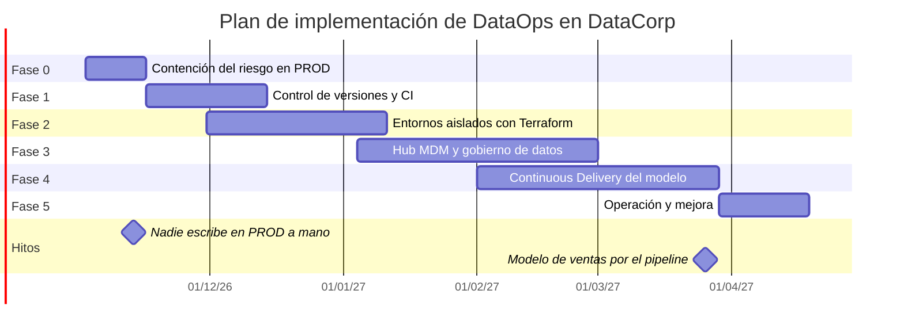
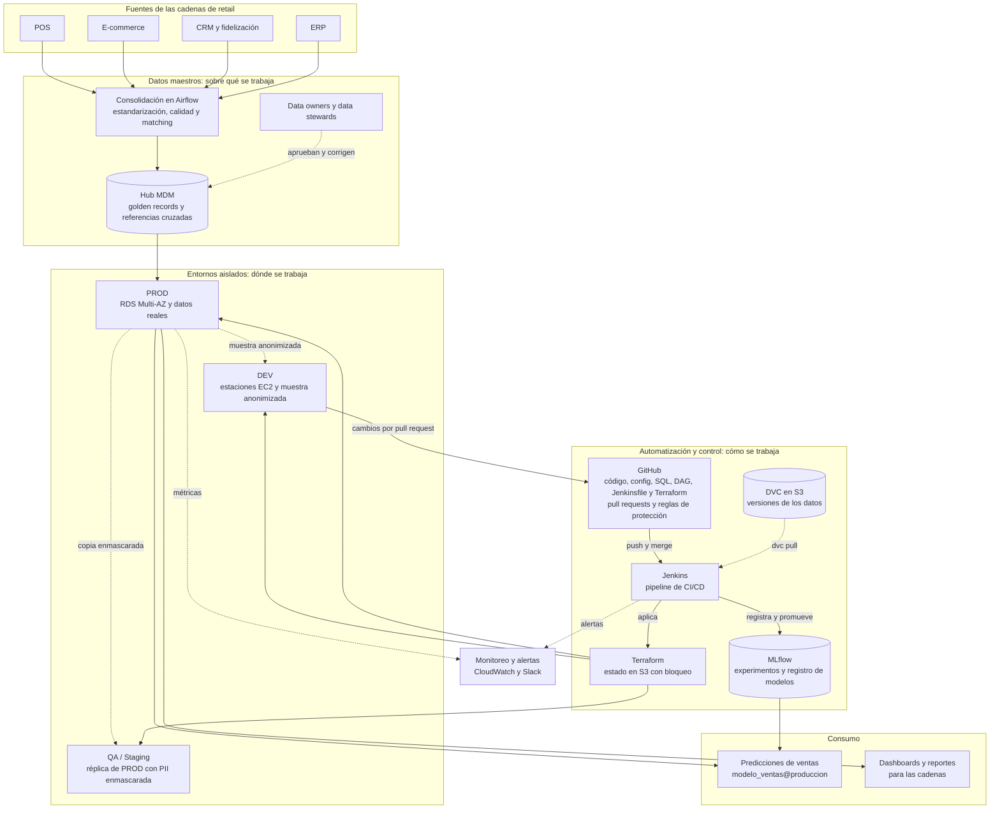

# Actividad 6: Integración final, la tripleta del control

Las actividades anteriores resolvieron cada pieza por separado: dónde se trabaja (entornos aislados), sobre qué datos se trabaja (MDM) y cómo se trabaja (control de versiones, IaC y CD). Esta actividad las junta en un plan para DataCorp, con métricas para saber si funciona, un informe para la dirección y la arquitectura completa.

## 6.1 Plan de implementación

El plan dura 24 semanas y sigue cuatro criterios:

- Primero se contiene el riesgo. Antes de construir cualquier cosa, se quita el acceso de escritura de las personas a producción, porque ese acceso es la causa directa de los incidentes que reporta la dirección.
- Se avanza con un piloto. El modelo de predicción de ventas es el primero en pasar por todo el proceso. Los demás modelos se migran cuando el camino ya está probado.
- Cada fase deja algo funcionando, aunque las siguientes se retrasen.
- Las fases se solapan cuando no dependen una de otra, para no alargar el plan.

| Fase | Semanas | Qué se hace | Entregable | Criterio para cerrarla |
|---|---|---|---|---|
| 0. Contención | 1 y 2 | Se retira el permiso de escritura de las cuentas personales sobre la base de producción, se crea una réplica de solo lectura para que los científicos de datos puedan seguir consultando, y se prueba que los respaldos se puedan restaurar | Permisos revisados y réplica de lectura | Ninguna cuenta personal puede escribir en PROD |
| 1. Control de versiones y CI | 3 a 6 | Repositorio con la estructura de la Actividad 3, reglas de protección de ramas, plantilla de PR, CODEOWNERS, DVC con remoto en S3 y Jenkins con la etapa Build & Test | Repositorio y pipeline de CI | Todo cambio al modelo de ventas entra por pull request con las pruebas en verde |
| 2. Entornos aislados con IaC | 5 a 10 | Terraform para DEV, QA y PROD (Actividad 4), importación al estado de Terraform de los recursos que ya existen, copia semanal con la PII enmascarada para QA y muestra anonimizada para DEV | Los tres entornos creados desde el mismo código | `terraform plan` no muestra diferencias entre el código y lo que hay en AWS en ninguno de los tres entornos |
| 3. MDM | 10 a 17 | Hub MDM con Tienda, Calendario comercial y Cliente primero, porque son las entidades que usa el modelo de ventas. Después Producto, Proveedor y Cuenta. Nombramiento de data owners y data stewards, y aprobación de la definición de cliente activo 1.0.0 (Actividad 2) | Hub con golden records y políticas aprobadas | Existe una sola cifra de clientes activos por cadena, y la usan tanto el modelo como los dashboards |
| 4. Continuous Delivery | 14 a 21 | Pipeline completo de la Actividad 5 con MLflow, despliegue por alias, aprobación manual y rollback, primero para el modelo de ventas | Modelo de ventas desplegado por el pipeline | Dos despliegues seguidos a PROD sin pasos manuales distintos de la aprobación |
| 5. Operación | 22 a 24 | Tablero de métricas de la sección 6.2, guía de onboarding, capacitación del equipo, primer ciclo de postmortems y revisión de permisos | Tablero de métricas y guías | Todas las métricas de la 6.2 medidas al menos una vez |

### Responsables

| Rol | Qué le toca en el plan |
|---|---|
| Dirección | Patrocina el plan, aprueba los recursos y revisa cada mes el tablero de métricas |
| Líder de ingeniería de datos | Dirige las fases 0, 1 y 2 y responde por el pipeline |
| Ingeniero de plataforma (nueva contratación o asignación) | Terraform, Jenkins y la cuenta de AWS |
| Líder de ciencia de datos | Lleva el modelo de ventas al pipeline en la fase 4 y define los umbrales de calidad del modelo |
| Data owners | Aprueban las definiciones y las políticas de sus entidades maestras en la fase 3 |
| Data stewards | Operan las reglas de calidad del hub y la cola de revisión manual |

### Dependencias entre componentes

La fase 0 va primero porque detiene los incidentes de inmediato y no depende de nada más. El pipeline de CD de la fase 4 necesita el repositorio de la fase 1 y los entornos de la fase 2, porque sin ellos no hay de dónde construir ni a dónde desplegar. El MDM puede empezar cuando los entornos ya existen, y sus entidades prioritarias tienen que estar listas antes de que el modelo de ventas salga a producción por el pipeline: el Test de Datos y la variable de clientes activos dependen de ellas. Por eso la salida del modelo a producción por el pipeline (semana 21) llega después de que el hub tiene Tienda, Calendario comercial y Cliente funcionando.

## 6.2 Métricas de éxito

El caso no trae cifras de cómo está DataCorp hoy, así que la línea base de cada métrica se mide durante la fase 0, con los datos que ya existen (registro de incidentes, tiempos de ingreso de personas nuevas y tiempos de recuperación de los últimos meses). Las metas son para el final del plan.

| Componente | Métrica | Cómo se mide | Meta a seis meses |
|---|---|---|---|
| Entornos aislados | Incidentes en producción causados por cambios sin probar | Registro de incidentes y postmortems | Ninguno en el último trimestre del plan |
| Entornos aislados | Cuentas personales con permiso de escritura en PROD | Revisión trimestral de IAM | Cero |
| Entornos aislados | Cambios que llegaron a PROD sin pasar por QA | Historial de ejecuciones de Jenkins | Cero |
| MDM | Definiciones distintas de "cliente activo" en uso | Archivos de `mdm/definiciones/` y reportes que las usan | Una |
| MDM | Pares de registros de Cliente con score de coincidencia mayor a 0,95 sin fusionar | Reporte diario del hub | Menos de 0,5 % de los registros |
| MDM | Registros en cuarentena resueltos en menos de cinco días hábiles | Cola del data steward | 95 % |
| Control de versiones | Modelos en producción replicables | Modelos en MLflow con commit, md5 de DVC y versión de la definición de cliente activo, más una prueba trimestral en la que se reentrena uno y se comparan las métricas | 100 % |
| Control de versiones | Cambios en `main` y `develop` que entraron por pull request | Reglas de protección de GitHub | 100 % |
| IaC | Recursos de los tres entornos gestionados por Terraform | Inventario de AWS comparado con el estado de Terraform | 100 % |
| IaC | Tiempo de onboarding de un científico de datos nuevo, hasta tener su estación y acceso a DEV | Se mide en cada ingreso | Menos de un día |
| IaC | Tiempo para crear un entorno completo desde cero | Prueba trimestral en una cuenta de pruebas | Menos de una hora |
| CD | Tiempo de recuperación ante fallos del modelo | Desde la alerta hasta que el alias `produccion` vuelve a la versión anterior | Menos de 15 minutos |
| CD | Tiempo desde el merge en `develop` hasta producción | Jenkins y GitHub | Menos de tres días hábiles |
| CD | Despliegues a producción que terminan en rollback | Jenkins | Menos de 10 % |
| CD | Fallos detectados antes de producción | Etapas que fallaron en Jenkins frente a incidentes en PROD | Más de 90 % |

Las cuatro métricas de CD siguen la idea de las métricas DORA (frecuencia, tiempo de entrega, tasa de fallos y tiempo de recuperación), adaptadas a un modelo de datos. El tablero se revisa cada mes con la dirección. Una métrica que se aleja de su meta dos meses seguidos se analiza en un postmortem.

## 6.3 Informe ejecutivo

El informe para la dirección está en [docs/06-informe-ejecutivo.md](06-informe-ejecutivo.md).

## 6.4 Arquitectura DataOps de DataCorp Analytics

El diagrama sigue la tripleta del control. Los tres bloques del centro responden a las preguntas de la Clase 6: los entornos aislados dicen dónde se trabaja, el MDM dice sobre qué datos y el bloque de automatización y control dice cómo.

Así se recorre la arquitectura con un cambio real. Los datos de las cadenas entran por el hub MDM, que los consolida y los publica en PROD con identificadores únicos. Desde PROD salen la copia enmascarada para QA y la muestra anonimizada para DEV. Una científica de datos trabaja en su estación de DEV, sube el cambio a GitHub y abre un pull request. Al hacer merge, Jenkins corre el pipeline: trae los datos de DVC, valida su calidad, entrena, registra el modelo en MLflow, aplica Terraform en QA, despliega en Staging y, con la aprobación del líder técnico, promueve el modelo a producción. Las predicciones que reciben las cadenas salen del modelo con alias `produccion`, y si algo falla, Jenkins y CloudWatch avisan por Slack y el alias vuelve a la versión anterior.
